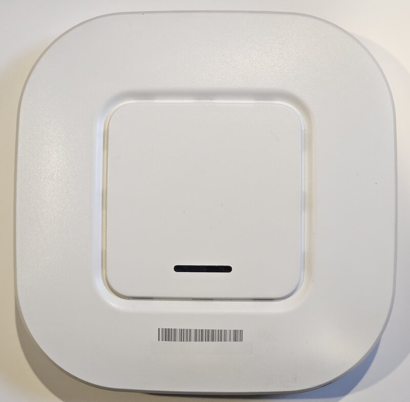

# Set up the hardware

**You'll learn:** How to place, cable, and power on your Guardian and Beacons, then put tags on your shelves.

**Before you start:**

- A store router that hands out network addresses automatically (called DHCP — most routers do this out of the box), with ordinary outbound internet.
- A note for your IT person, if you have one: the Guardian needs one outbound UDP port, **51820**. It needs **no** inbound ports and **no** port-forwarding.
- A power outlet for the Guardian and one for each Beacon.
- The quick-start card from the box — it shows the port map.

!!! video "Watch: Set up the hardware (~5 min)"
    Video coming soon — the written steps below cover everything.

Everything in the box arrives pre-set for your store. Setup is placing, plugging, and listening — there is nothing to type in and nothing to configure.

1. **Place the Guardian** somewhere central or back-of-house, near your store's router.

2. **Place each Beacon on the sales floor** so every shelf that will hold a tag is within roughly 10–15 metres (about 30–50 feet) of a Beacon. Avoid mounting a Beacon directly on a metal surface.

    { width="240" }

3. **Run an Ethernet cable from your router to the Guardian's uplink port** — the port labelled **ETH0** on the quick-start card.

    !!! screenshot "Screenshot: Back of the Guardian showing the four network ports, with the ETH0 uplink port highlighted"
        To capture: assets/hardware/guardian-rear-ports.png

4. **Run a separate Ethernet cable from each Beacon to a numbered Beacon port** on the Guardian: **ETH1**, **ETH2**, or **ETH3**. One Beacon per port, each with its own cable.

    !!! warning "Beacons plug into the Guardian — never into your store's network"
        Do not plug a Beacon into your store's router or a network switch. It will not work there. Each Beacon must connect directly to one of the Guardian's numbered ports.

5. **Power on the Guardian and every Beacon.**

6. **Listen to the Guardian's beeper.** Two short pips means it has spotted a Beacon. An ascending chirp within about a minute means that Beacon is online. A descending tone means the check failed — unplug that Beacon's cable and power, plug them back in, and listen again.

7. **Skip Beacon setup — there is none.** Beacons set themselves up. There are no settings to enter and no buttons to press.

8. **Stick your tags on the shelves.** Peel and stick each tag where its product sits (clip and rail mounts work too). The arrow printed on the back shows which way to mount it. Tags talk to whichever Beacon has the strongest signal, all on their own — so you can move a tag to another shelf later with zero setup.

    !!! screenshot "Screenshot: Back of a shelf tag with the orientation arrow highlighted"
        To capture: assets/hardware/tag-back-orientation-arrow.png

!!! tip "You may notice a new Wi-Fi network — that's expected"
    Each Beacon broadcasts its own small wireless network. It's there for the store handhelds (the phones your staff will use later). If you spot an unfamiliar network name during a Wi-Fi check, it isn't a rogue device — it's your Beacons.

## Check your work

- You heard two pips and then an ascending chirp for every Beacon you plugged in.
- Each Beacon has its own cable running straight to a numbered port on the Guardian.
- Your tags are on the shelves. They won't show prices yet — that comes after you connect your product data in a later lesson.
- There's nothing else to see right now. The next lesson opens the dashboard, where you'll watch your tags appear.

## If something looks wrong

**Descending tone after plugging in a Beacon** — the Guardian's check failed. Unplug and re-plug that Beacon's cable and power, then listen for the ascending chirp.

**No sound at all for a Beacon** — check that its cable runs directly to ETH1, ETH2, or ETH3 on the Guardian, not to your router or a switch.

**One area of the store is far from every Beacon** — move a Beacon closer, or off any metal surface. Tags find the strongest Beacon on their own; there is nothing to reconfigure.

**Next:** [Sign in to your Guardian console](a3-sign-in.md)
