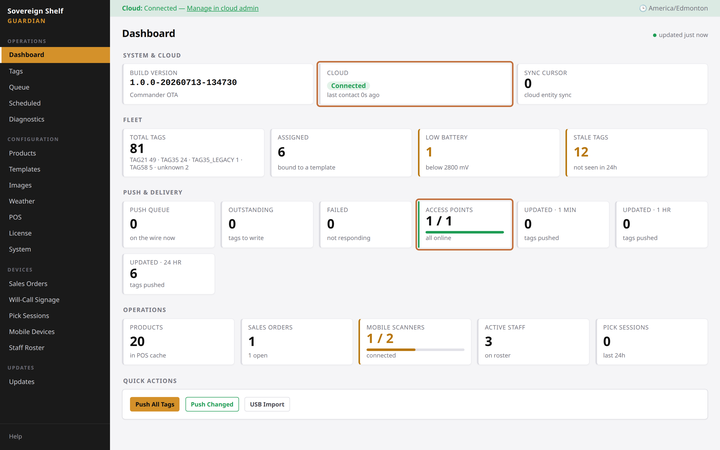

# Sign in to your Guardian console

**You'll learn:** how to open the Guardian console — the dashboard you open in a web browser on your store's network — and what its main tiles mean.

**Before you start:**

- Your Guardian and Beacons are plugged in and powered on (see [Set up the hardware](a2-set-up-the-hardware.md)).
- A computer or tablet connected to your store's network.
- The quick-start card from the box. It has the console address and your sign-in details.

!!! video "Watch: Sign in to your Guardian console (~3 min)"
    Video coming soon — the written steps below cover everything.

## Open the console and sign in

1. Open a web browser on your computer or tablet.
2. Type `http://commander.local:8080` into the address bar and press Enter. This is the address printed on your quick-start card.
    <!-- REVIEW: confirm commander.local on shipping builds -->
3. Wait for a small sign-in box to pop up. It is the browser's own plain box — there is no styled login page. That is normal.
4. Enter the username and password printed on your quick-start card.
5. Look around — you have landed on the Dashboard. The menu on the left lists everything the console can do.

!!! tip "Bookmark it"
    Save the Dashboard as a bookmark now, so you can get back with one click.

??? note "The address won't load?"
    Some routers block local names like `commander.local`. If the page never opens:

    1. Sign in to your router and open its list of connected devices. Router brands name this differently — look for "Device list," "Client list," or "Attached devices."
    2. Find the Guardian in that list and note its IP address (four numbers with dots, like 192.168.1.50).
    3. In your browser, go to `http://<that address>:8080` — for example, `http://192.168.1.50:8080`.

## Take a quick tour of the Dashboard

The Dashboard is your store's live health check. It refreshes itself every 10 seconds — you never need to reload the page.

Six tiles are worth knowing on day one:

- **Cloud** — a pill that reads **Connected** or **Offline**. Connected means your Guardian is syncing with your cloud dashboard at sovereignshelf.net.
- **Total Tags** — how many shelf tags your Beacons have found so far, with a count for each size. Tags appear here automatically as Beacons discover them — you never type tag codes in. Watch this number climb today.
- **Access Points** — how many of your Beacons are online. The console calls Beacons "Access Points" — same thing.
- **Low Battery** — tags reporting a low battery.
- **Push Queue** — updates waiting to be sent to tags.
- **Updated** — how many tags received an update in the last minute, hour, and 24 hours.

Most other tiles will sit at zero today. They fill in as you connect your product data and bind your first tags in the next lessons.

## Check your work

- The Dashboard is open and refreshes on its own — watch the "updated" note near the top right tick over.
- The **Access Points** tile shows the same number of Beacons you plugged in.
- **Total Tags** is climbing as your Beacons find the tags on your shelves.

## If something looks wrong

**The address will not load** — some routers block local names. Find the Guardian's IP address in your router's device list and browse to `http://<that address>:8080` instead (see the note above).

**Access Points shows zero** — a Beacon is not connecting. Re-check the cabling from [Set up the hardware](a2-set-up-the-hardware.md): each Beacon needs its own cable running straight to a numbered port on the Guardian.

**The Cloud pill says Offline** — your store still works. Check your internet connection; the Guardian reconnects and catches up on its own.

**Next:** [Connect your product data](a4-connect-your-product-data.md)
