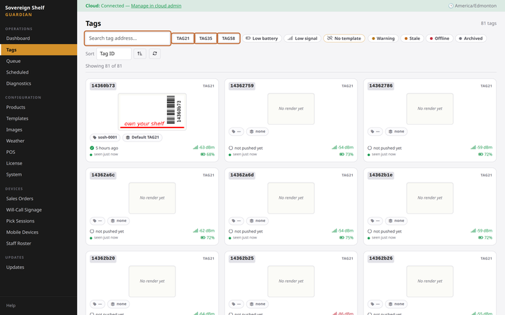
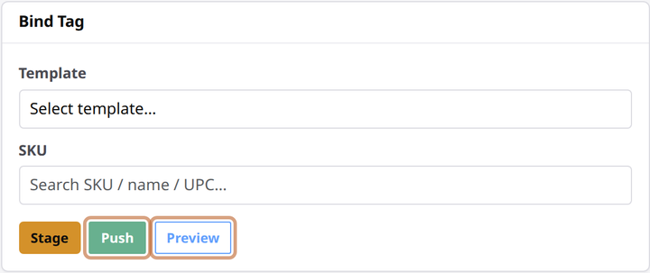

# Bind your first tag

**You'll learn:** how to bind a tag — link it to a product — and send its first price to the shelf.

**Before you start:**

- You're signed in to the Guardian console — the dashboard you open in a web browser on your store's network ([Sign in to your Guardian console](a3-sign-in.md)).
- Your products have synced from your point-of-sale system (POS). The Products page should show your catalog. If it's empty, go back to [Connect your product data](a4-connect-your-product-data.md).
- At least one tag shows up on the Tags page. Tags appear on their own once your Beacons are running — you never type them in.

!!! video "Watch: Bind your first tag (~4 min)"
    Video coming soon — the written steps below cover everything.

## Download a starter template

A template is the layout a tag displays — where the name, price, and barcode go. Ready-made designs come from the Sovereign Shelf template library, sized for each tag.

1. Click **Templates** in the sidebar, then click **Download** on a library design that matches your tag's size. It's now yours to use. (Later on, you can build your own designs in the Template Designer — covered in the [Designing your shelf labels](../owners/templates/index.md) module.)

## Find your tag

1. Click **Tags** in the sidebar.
2. Type the tag code (the 8-character code printed on the tag) into the search box. Or click a size chip — TAG21, TAG35, or TAG58 (2.1-inch, 3.5-inch, and 5.8-inch labels) — to narrow the list.
3. Click the tag's card to open its detail page.

## Bind and push

1. In the **Bind Tag** card, pick a **Template**. The dropdown only lists templates that fit this tag's size.
2. In the product box, start typing the product's name, SKU, or barcode. Suggestions appear as you type — click the right one.
3. If an **Image** dropdown appears, leave it alone for now. It only shows up when the template has a spot for a picture, and you can add one later.
4. Click **Preview** to see exactly what the tag will show. This touches nothing on the shelf — it's just a picture on your screen.
5. Click **Push** to send the update to the tag now.
6. Watch the shelf. Within a couple of minutes, the tag flashes black, white, and red for a few seconds, then shows your product. That flash is normal — it's how the screen redraws.

!!! tip "Have a barcode gun?"
    Scan straight into the product box. An exact match selects itself, and the scan's Enter keystroke never submits the form. It's the fastest way to bind.

!!! tip "Push vs. Stage"
    **Push** sends the update now. **Stage** saves it and delivers it with the next scheduled update — handy when you'd rather not have screens flashing in front of customers.

## Find a tag on the shelf

Not sure which shelf a tag is sitting on? Make it blink.

1. On the tag's detail page, find the **Flash LED** card.
2. Pick a colour — red, green, or blue.
3. Click **Flash 30s**. The tag's light blinks in that colour for 30 seconds while you walk over and spot it.

??? note "Changed your mind?"
    Just bind the tag again — pick a different template or product and push. The newest bind always replaces the older one, even one still waiting in the queue. To remove the link entirely, click **Unbind** on the tag's page. The tag keeps showing its last image until you bind it to something else.

## Check your work

- The tag's detail page shows your product under **Current Binding**, and **Current Display** shows the exact image now on the tag.
- Back on the Tags page, the tag's card shows the new display and the product's SKU.
- The physical tag on the shelf matches the preview you saw.

## If something looks wrong

**Nothing on the tag after 5 minutes** — open the **Queue** page to see if the update is still waiting, then check the signal and battery badges on the tag's page. Weak signal or a low battery is the usual cause.

**Your product isn't in the suggestions** — it may not have synced yet. Product sync runs about every 5 minutes; try again in a few minutes.

**Next:** [First-day settings](a6-first-day-settings.md)
