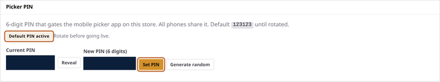

# Set your first-day settings

**You'll learn:** three quick settings to lock in before your store goes live — default templates, your staff PIN, and your timezone.

**Before you start:**

- You're signed in to the Guardian console — the dashboard you open in a web browser on your store's network ([Sign in to your Guardian console](a3-sign-in.md)).
- You've downloaded at least one template, as in [Bind your first tag](a5-bind-your-first-tag.md).

## Pick default templates

When staff bind a tag from a store handheld, they don't choose a layout — the Guardian uses the default template for that tag's size. Until you set one, phone binds fail with a clear "no default template configured" error.

1. Click **Templates** in the sidebar.
2. Find the **Defaults** card. Under Price tags, there's one row per tag size.
3. Pick a template in the **Normal** dropdown for each tag size you own — TAG21, TAG35, or TAG58 (2.1-inch, 3.5-inch, and 5.8-inch labels). This is the everyday price look, and it's what makes handheld binds work.
4. Pick a template in the **Onsale** dropdown for each size too. Setting both Normal and Onsale links them as a pair: tags flip to the sale look automatically while a product's sale dates are active, then flip back when the sale ends. No manual switching — it's driven by the sale dates in your point-of-sale system (POS).
5. Watch for the **Saved** tick after each pick — changes save instantly, with no save button to click.

!!! screenshot "Screenshot: Templates page Defaults card, with one row's Normal and Onsale dropdowns highlighted"
    To capture: assets/console/templates-defaults-card.png

??? note "The other Defaults rows"
    Below Price tags you'll see rows for Pick-by-Light, Will-call, and Weather. Those belong to features covered in later lessons — you can leave them empty for now.

## Change the staff PIN

One 6-digit PIN unlocks every store handheld. Your Guardian ships with a factory PIN, and the console shows a warning until you replace it.

1. Click **System** in the sidebar.
2. Find the staff PIN card — the console labels it **Picker PIN**.
3. Type your own 6 digits into **New PIN** and click **Set PIN** — or click **Generate random** to let the console pick one.
4. If you generate a random PIN, it's shown exactly once. Write it down before you leave the page.
5. Share the new PIN with your staff. Each phone asks for it the next time it locks — nobody gets kicked out mid-task.

!!! warning "Don't skip this one"
    The factory PIN is not unique to your store. Change it before the handhelds go into daily use — the console keeps warning you until you do.

## Set your timezone

1. Still on the **System** page, find the **Timezone** card. It shows the current zone and the local time.
2. Pick your zone from the dropdown.
3. Click **Apply**. Every timestamp in the console — "last seen", "pending since", push times — now shows in your local time. This is display only; it changes how times are shown, nothing else.

## Check your work

- The Defaults card shows a Normal and an Onsale choice for every tag size you own.
- The System page no longer shows the staff PIN warning.
- The Timezone card shows your zone, and the time on it matches your wall clock.

## If something looks wrong

**A Defaults dropdown is empty** — each dropdown only lists templates that match that role. On the Templates page, click the template's purpose pill, pick the matching purpose, and click the checkmark. It shows up in the dropdown right away.

**A phone says "no default template configured"** — the error names the tag size. Come back to the Defaults card and set the Normal template for that size.

**Times look wrong after changing the timezone** — the change takes effect immediately, so "seen 2 hours ago" style captions shift to the new zone. Your data is untouched.

**Next:** [Train your team](a7-train-your-team.md)
