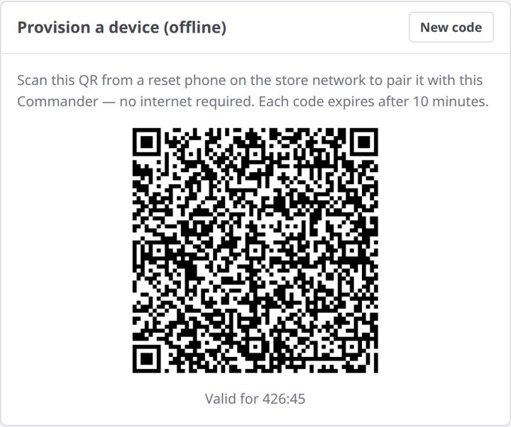

# Train your team

**You'll learn:** how to hand the system to your staff — pair the store handhelds, add your team's names, and point everyone at their own short guide.

**Before you start:**

- You're signed in to the Guardian console — the dashboard you open in a web browser on your store's network ([Sign in to your Guardian console](a3-sign-in.md)).
- You've finished [First-day settings](a6-first-day-settings.md) — you'll need the staff PIN you set there.
- Your store handhelds are unboxed and charged. They arrive with the Sovereign Shelf app already installed.

This is the last lesson in Getting Started. Five items, and your team is up and running.

## 1. Pair the store handhelds

Each phone needs a one-time introduction to your store.

1. Click **Mobile Devices** in the console.
2. Find the pairing QR code in the **Provision a device (offline)** card. Each code expires after 10 minutes, and the page replaces it automatically — always scan the live on-screen code. Click **New code** anytime for a fresh one.
3. On the phone, follow the first-run wizard. When the camera opens, point the phone at the QR code on your computer screen.
4. Click **Refresh** on the **Bound mobile devices** table. The phone appears with a green **Active** badge.

Repeat for each phone. That's the short version — the upcoming Setting up staff phones lessons walk through every wizard screen, plus what to do when a phone is replaced or moves to another store.

!!! tip "Scan the screen, not a printout"
    Pairing codes expire every 10 minutes, and the page quietly swaps in a new one before that happens. A printed or photographed code stops working fast — always scan the code live on your screen.

## 2. Add your staff's names

1. Click **Staff Roster** in the console.
2. Type each person's first name into **Add a name** and click **Add**.

The names appear in the name picker on every phone. When someone picks their name, their scans and picks are credited to them. Names and activity never leave the store — they stay on your Guardian.

## 3. Share the staff PIN

Tell your team the 6-digit staff PIN you set in [First-day settings](a6-first-day-settings.md). The phones lock when they sit idle, and this PIN unlocks them. Everyone in the store shares the same one.

## 4. Hand your team their guide

Send your staff these two short lessons — each takes about five minutes:

- [Look up a product](../staff/f2-look-up-a-product.md)
- [Update a shelf tag](../staff/f3-update-a-shelf-tag.md)

That's the whole reading list for a floor person's first day.

## 5. Know where to get help

For anything you can't solve, email Sovereign Shelf support (support@sovereignshelf.com). With your consent, support can assist remotely through your Guardian's built-in secure cloud connection — no firewall changes and nothing to install on your side.

## You're live

That's the whole setup — your store is running on Sovereign Shelf. From here on, the console **Dashboard** is your daily health check: one glance shows your Beacons online, your tags up to date, and your products syncing. Make it part of opening the store.

## Check your work

- Every store handheld shows a green **Active** badge in the **Bound mobile devices** table.
- Your staff's first names show up in the name picker on the phones.
- A staff member can unlock a phone with the staff PIN and look up a product.

## If something looks wrong

**The phone doesn't show up in the table** — click **Refresh**. Still missing? The code probably expired mid-pairing. Click **New code** and scan again.

**The phone won't accept the code** — codes expire every 10 minutes. Scan the live code on your screen, never a photo or printout.

**A name isn't showing on a phone** — the phones pick up roster changes on their own. Give it a minute, then check the name picker again.
<!-- REVIEW: confirm how quickly Staff Roster changes reach the phones' name picker -->

**Next:** [Look up a product](../staff/f2-look-up-a-product.md) — skim the staff lessons yourself, so you know exactly what your team sees. Deeper owner guides — connecting your POS, designing your own templates, and running the store day to day — are coming next.
