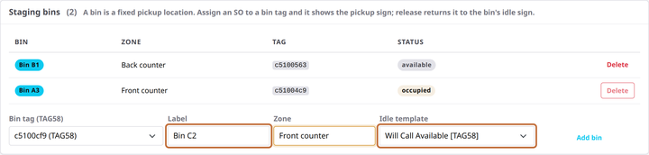
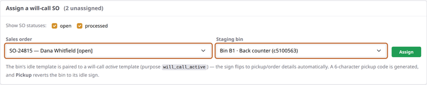
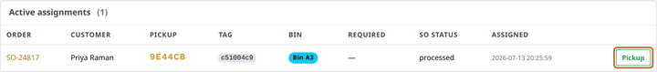

# Set up will-call pickup signs

**You'll learn:** how to turn a spare large tag into a fixed pickup bin whose sign greets your customer with their name and a pickup code — and how to release it when the order goes home.

**Before you start:**

- Customer orders are flowing in ([Bring in sales orders](../pos/b5-sales-orders.md)).
- You have a spare large (5.8") tag to give the job to — pickup signs need the room.
- Your Templates page has a will-call pair set up: an idle design for the empty bin and an active one for the occupied sign. The [template purposes reference](../../reference/template-purposes.md) explains the pairing; the starter library includes ready-made will-call designs.

Here's the idea: a **bin** is a fixed pickup spot — a shelf, a cubby, a numbered slot behind the counter. The tag on it normally shows an idle sign ("Bin A3 — available"). Assign a customer order to it, and the sign flips to the customer's name and a short pickup code. Release it, and the bin is back in service. Once set up, your staff run the whole cycle from their phones — [their lesson is here](../../staff/f6-will-call-pickup-signs.md).

## Create your bins (one-time)

1. In the Guardian console, click **Will-Call Signage** in the left menu.

2. In the **Staging bins** card, fill in the small form: pick the **Bin tag** (only large tags are offered), give it a **Label** your staff will say out loud ("Bin A3"), optionally a **Zone** ("Front counter"), and choose the **Idle template** — the design the sign shows while the bin is empty. Click **Add bin**.

    

3. Watch the shelf: the tag flashes and comes up showing the idle sign. Make as many bins as you have pickup spots.

## Assign an order to a bin

4. In the **Assign a will-call SO** card, pick the customer order, the bin, and confirm. The console generates a short pickup code automatically, and the bin's sign flips to the customer's name and that code.

    

    Don't see the order you expect? The list shows orders that came in through your sales-order sync — [Bring in sales orders](../pos/b5-sales-orders.md) covers the filter that decides which ones those are.

## Release it at pickup

5. When the customer collects, find the order in **Active assignments** and click **Pickup**. The assignment clears and the bin's sign returns to its idle design, ready for the next order.

    

Day to day, your staff do steps 4 and 5 from their handhelds by scanning the bin's tag — the console is where you set bins up and keep an eye on the board.

??? note "Signs without bins (ad-hoc)"
    Staff can also assign an order to *any* spare tag straight from a phone — no bin required. An ad-hoc sign works the same, with one difference at release: instead of an idle bin design, the tag goes back to whatever product it showed before. Handy for overflow days; bins are better for spots you use every week.

## Check your work

- Each bin's tag shows its idle sign on the shelf.
- Assign a test order: the sign flips to the customer name and pickup code within moments.
- Click **Pickup**: the sign returns to idle, and the bin's row shows available again.

## If something looks wrong

**The Idle template dropdown is empty** — no template in your store carries the will-call purpose yet. Set one up on the Templates page first ([purposes and defaults](../templates/c12-sale-layouts-and-defaults.md)).

**The Delete button on a bin is greyed out** — the bin has an order on it. Release the assignment first (that's deliberate: deleting an occupied bin would strand a customer's sign).

**The order isn't in the assign list** — it either hasn't synced yet or falls outside your sales-order filter. [Bring in sales orders](../pos/b5-sales-orders.md) starts with exactly this symptom.

**The sign didn't update on the shelf** — give it a minute, then check the tag the usual way: is it in range of a Beacon, and does its battery read healthy on the Tags page?

**Next:** hand the day-to-day to your team — [Will-call pickup signs](../../staff/f6-will-call-pickup-signs.md) is their five-minute version.
