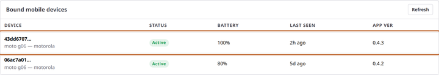

# Pair a phone

**You'll learn:** how to introduce a store handheld to your Commander with a QR code — every screen, from the box to the green **Active** badge.

**Before you start:**

- You're signed in to the Guardian console ([Sign in](../../getting-started/a3-sign-in.md)).
- The phone is charged and either brand new or freshly reset. It arrives with the Sovereign Shelf app already installed.
- You know your store's wireless network name and password, in case the phone asks.

!!! video "Watch: Pair a phone (~3 min)"
    Video coming soon — the written steps below cover everything.

Pairing is a one-time introduction: the phone scans a code from your screen and from then on it belongs to your store. There are no usernames or passwords to type on the phone — the QR code is the whole credential. And it all happens inside your store: pairing works even when the internet is down.

## Put the code on your screen

1. In the Guardian console, click **Mobile Devices** in the left menu.

2. Find the QR code in the **Provision a device (offline)** card. Under it, a countdown shows how long the code stays valid — each code expires after 10 minutes, and the page quietly swaps in a fresh one before that happens. Click **New code** anytime if you want a fresh one on the spot.

    

!!! tip "Scan the screen, not a printout"
    A printed or photographed code stops working within minutes — always scan the code live on your screen. That short life is a feature: a code that leaks can't be used later.

## Walk the phone through its first run

3. Turn the phone on. The Sovereign Shelf app opens straight into its first-run wizard and greets you with a welcome screen.

4. If the phone isn't connected to your store's wireless network yet, the wizard walks you through joining it. Already connected? This step steps aside on its own.

5. When the camera opens, point the phone at the QR code on your computer screen. A moment later the phone confirms **Paired to** followed by your store's name, and lands on its home screen.

    !!! screenshot "Screenshot: first-run wizard scan step, camera frame pointed at a pairing QR"
        To capture: assets/app/wizard-scan-qr.png

    !!! screenshot "Screenshot: the Paired confirmation naming the store, just before the home screen"
        To capture: assets/app/wizard-paired.png

## Confirm it took

6. Back in the console, click **Refresh** on the **Bound mobile devices** table. The phone appears with a green **Active** badge, along with its battery level, when it was last seen, and its app version.

    

Repeat for each phone — a new code appears automatically as you go. When the last one shows **Active**, hand the phones over and point your team at [their own short guide](../../staff/f2-look-up-a-product.md).

??? note "Phones set up before they reach you"
    Sovereign Shelf support can pre-provision a phone before it ships to you. A phone set up that way appears in your device table with a blue **Provisioned** badge, and flips to **Active** on its own the first time it's used on your store's network. Nothing for you to do — the badge is just the phone in transit between "set up" and "seen here."

## Check your work

- The phone shows in **Bound mobile devices** with a green **Active** badge.
- The phone's home screen shows its tabs, and the lock screen accepts the staff PIN you set in [First-day settings](../../getting-started/a6-first-day-settings.md).

## If something looks wrong

**The phone doesn't appear in the table** — click **Refresh**. Still missing? The code probably expired mid-pairing. Click **New code** and scan again.

**The camera scans but nothing happens** — the phone likely isn't on your store's network yet. Join the store wireless and scan a fresh code.

**The phone says it belongs to a different store** — it was paired somewhere else first and is politely refusing your code. This happens with phones moved between locations — email Sovereign Shelf support (support@sovereignshelf.com) and they'll release it.

**Next:** [Choose which features staff see](d5-feature-toggles.md)
