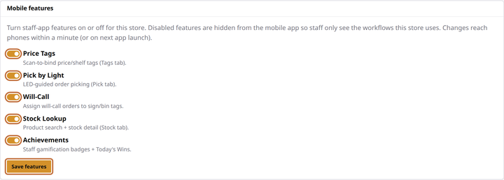

# Choose which features staff see

**You'll learn:** how to trim the staff app down to just the workflows your store uses, with five switches on the Guardian console.

**Before you start:**

- You're signed in to the Guardian console ([Sign in](../../getting-started/a3-sign-in.md)).
- At least one phone is paired ([Pair a phone](d2-pair-a-phone.md)), so you can watch a change land.

Not every store picks orders or runs will-call pickups. Anything you switch off here disappears from every phone in the store — staff only ever see the workflows that apply to them.

## Flip the switches

1. In the Guardian console, click **System** in the left menu.

2. Find the **Mobile features** card. It lists five switches, each with a one-line description:

    - **Price Tags** — scan-to-bind price and shelf tags (the Tags tab).
    - **Pick by Light** — LED-guided order picking (the Pick tab).
    - **Will-Call** — assigning pickup orders to sign tags.
    - **Stock Lookup** — product search and stock detail (the Stock tab).
    - **Achievements** — staff badges and Today's Wins.

3. Untick anything your store doesn't use, then click **Save features**.

    

That's the whole job. Changes reach phones on their own: within about a minute on a phone that's in use, within a few minutes on one sitting in a pocket, and instantly when the app is reopened.

## What switching a feature off really does

Two things, not one:

- **The phones hide it.** The tab or menu entry disappears, so staff can't wander into a workflow the store doesn't run.
- **The system refuses it.** Even a tag bound before you flipped the switch can't take new bindings for that purpose — the feature is off store-wide, not just hidden.

Everything is **on** out of the box, so a store that uses the lot never touches this page.

## Check your work

- Pick up a paired phone, wait a minute (or close and reopen the app) — the switched-off tab is gone.
- The remaining tabs work exactly as before.

## If something looks wrong

**Every feature is showing on a phone, including ones you switched off** — that's the phone telling you it can't reach your Commander right now. When in doubt, the app shows *everything* rather than hiding tools staff might need. Check the phone is on the store wireless; the moment it reconnects, your settings apply.

**A feature you just disabled is still showing** — give it a minute, or close and reopen the app on that phone. Still there? Re-check the switch actually saved: the **Mobile features** card should show it unticked.

**Staff report a tab is missing** — that's usually this page doing its job. Check the switches before suspecting the phone.

**Next:** More phone lessons are coming (the two PINs, the staff roster in depth, fleet care). Meanwhile, [Running the store day-to-day](../operations/index.md) starts with will-call pickup signs.
