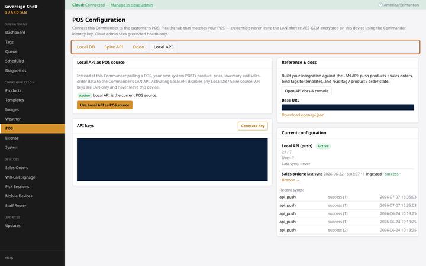
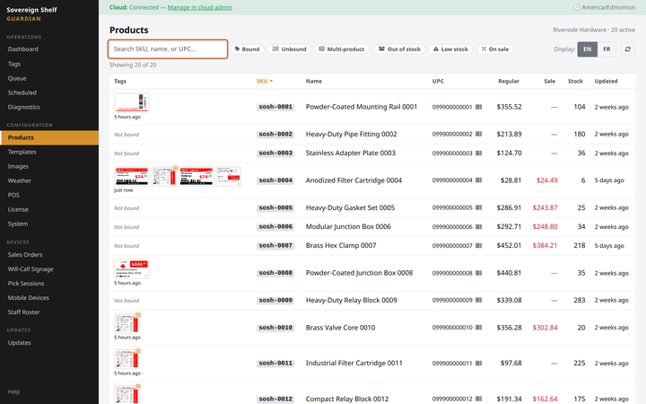

# Connect a SQL-database POS

**You'll learn:** how to connect your Commander to a POS built on a SQL database — Logivision LS and many others — and run your first sync.

**Before you start:**

- Read [How product sync works](b0-how-sync-works.md) — five minutes, nothing to click.
- You're signed in to the Guardian console ([Sign in](../../getting-started/a3-sign-in.md)).
- You have a **read-only** database username and password from your POS provider or IT support. Some POS databases are set up to accept connections without one — if that's yours, you can leave those boxes blank.

1. In the Guardian console, click **POS** in the left menu, under **Configuration**. The **Local DB** tab is already selected — it's the first one.

    

2. Click **Detect on LAN**. The Commander sends a discovery call across your store network and lists every SQL Server that answers, with its address filled in. Click yours and the connection form fills itself in.

    !!! screenshot "Screenshot: Local DB tab with Detect on LAN results listed and one server highlighted"
        To capture: assets/console/pos-localdb-detect-results.png

    If nothing shows up, that's common — some networks keep the POS server in its own segment, and some servers just don't answer. Type the **Host / IP** and **Port** yourself instead (the port is almost always the default, 1433). Your IT support has these.

3. Enter the **Username** and **Password**. Both are optional — the hint under the password box says it: leave them blank for wide-open or Windows-trusted databases.

4. Click **List** next to the **Database** box. The Commander signs in with those credentials and lists the databases it can see — pick yours. If the list shows only one, that's usually a good sign: a properly restricted login sees only its own database.

5. Leave the **TLS** boxes — **Encrypt** and **Trust certificate** — switched on. The defaults work with any certificate, including the self-signed ones most POS servers use. If a test fails with a connection error you can't explain, click **Auto-detect TLS** and the Commander tries the safe combinations for you.

6. Leave **POS Profile** on **Auto-detect (recommended)**.

7. Click **Test connection**. The test runs entirely on your Commander and takes a few seconds. When it passes, the **Test result** card shows the vendor it found and a product count — your first proof the catalog is really there. The Commander also recognizes *which* POS it's talking to and fills in the profile for you (Logivision shows up as **Logivision LS POS**).

    !!! screenshot "Screenshot: Test result card showing OK with vendor and product count, Auto-detected profile line highlighted"
        To capture: assets/console/pos-localdb-test-ok.png

    If the test fails, the message tells you which part went wrong — reaching the server, signing in, or opening the database. [Fix POS problems](b6-troubleshooting.md) has the cheat sheet.

8. Click **Save**. The button unlocks only after a passing test — that's a safety check, not a bug. Your credentials are encrypted and stored on your Commander only.

9. Click **Run sync now**, then click **Products** in the left menu and watch your catalog fill in. (If you skip the button, the first sync starts on its own within about 5 minutes.)

    

!!! tip "What Logivision stores get — and don't"
    A SQL-database connection carries products and prices — perfect shelf tags. It does **not** carry customer sales orders, so the order-driven features (picking lights, pickup signs) aren't available with Logivision. One more quirk: a change to a product's *name alone* can wait for the nightly pass; prices always move within minutes.

??? note "The Commander didn't recognize my POS"
    If the test passes but no profile matches, your POS keeps its data in a shape the Commander hasn't met before. Pick **Generic SQL (operator-supplied queries)** and email Sovereign Shelf support (support@sovereignshelf.com) — connecting an unrecognized system is a short, one-time setup done together with support, and once it's mapped it syncs like any other.

## Check your work

- The **Current configuration** card on the POS page shows your connection with a green **Active** badge and a **Last sync** time.
- The **Recent syncs** list below it shows green, completed runs.
- The **Products** page shows your catalog — search for a product you know you carry.

## If something looks wrong

**Detect on LAN finds nothing** — your POS server is probably on a separate network segment, or doesn't answer discovery calls. Nothing is broken: type the address and port in manually.

**The List button shows no databases** — the username you entered can sign in but can't see any database. Ask your POS provider to point the login at the right one.

**Test fails, or syncing stops later** — head to [Fix POS problems](b6-troubleshooting.md). The most common cause, by far: the database password was changed on the POS side.

Your products are flowing in on their own from here. Time to make the shelves look the part.

**Next:** [Designing your shelf labels](../templates/index.md)
