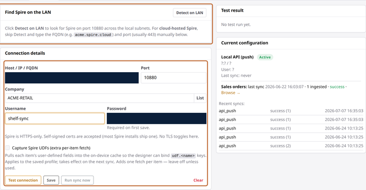

# Connect Spire

**You'll learn:** how to connect your Commander to Spire, pick your company, and run your first sync — including the sales orders that power picking lights and pickup signs.

**Before you start:**

- Read [How product sync works](b0-how-sync-works.md) — five minutes, nothing to click.
- You're signed in to the Guardian console ([Sign in](../../getting-started/a3-sign-in.md)).
- You have a Spire username and password with read access. If your Spire is cloud-hosted, also have its web address handy (something like `acme.spire.cloud`).

1. In the Guardian console, click **POS** in the left menu, under **Configuration**, then click the **Spire API** tab.

2. Click **Detect on LAN**. If your Spire server lives in the store, it appears in the list — click it and the address fills in, with the port already on Spire's standard 10880.

    

    Running **cloud-hosted Spire** instead? Skip the detection: type your Spire address into **Host / IP / FQDN** and change the **Port** to 443.

3. Enter your Spire **Username** and **Password**. The password is required the first time you save; after that, leaving it blank keeps the stored one.

4. Click **List** next to **Company**. The Commander asks your Spire server which companies it hosts — pick the one this store belongs to. Most stores see exactly one.

5. Click **Test connection**. A note on the form says it plainly: Spire connections are always encrypted, and the self-signed certificates most Spire installs ship with are accepted automatically — there are no security switches for you to fiddle with.

    !!! screenshot "Screenshot: Spire Test result card showing OK, Save button enabled below the form"
        To capture: assets/console/pos-spire-test-ok.png

6. Click **Save** — it unlocks once the test passes — then click **Run sync now** and watch the **Products** page fill in.

## What a Spire connection carries

Spire gives you the full package: your product catalog and prices for the shelf tags, **plus your customer sales orders**. Orders are what unlock the order-driven features — flashing picking lights and will-call pickup signs. Once your products are in, [Bring in sales orders](b5-sales-orders.md) shows you how to control which orders sync.

??? note "Custom fields from Spire (advanced)"
    Spire lets you attach your own extra fields to products — user-defined fields, or UDFs. If your label designs need one of them (say, a country of origin or a unit size), tick **Capture Spire UDFs (extra per-item fetch)** and save. From the next sync onward those fields become available to bind in the Designer, alongside the standard ones in the [data fields reference](../../reference/data-fields.md).

    Leave the box off unless a template actually uses one: capturing UDFs adds an extra fetch for every product, which makes each sync work harder for data nobody displays.

## Check your work

- The **Current configuration** card shows your Spire connection with a green **Active** badge, your company, and a **Last sync** time.
- The **Recent syncs** list shows green, completed runs.
- The **Products** page shows your catalog — search for a product you know you carry.

## If something looks wrong

**Detect on LAN finds nothing** — your Spire is cloud-hosted, or the server sits in a separate network segment. Type the address manually (and use port 443 for hosted Spire).

**Spire rejected the credentials** — the username or password is wrong, or it changed on the Spire side. Re-enter and test again. If it worked for weeks and stopped suddenly, the password changed — [Fix POS problems](b6-troubleshooting.md) starts with exactly this case.

**The Company list comes back empty** — your Spire login signs in but has no company access. Ask whoever manages your Spire to grant it.

**Next:** [Bring in sales orders](b5-sales-orders.md)
