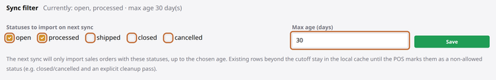

# Bring in sales orders

**You'll learn:** how to pull customer sales orders from your POS, control which ones sync, and read the Sales Orders page.

**Before you start:**

- Your products are already syncing from **Spire** ([Connect Spire](b2-spire.md)). Sales orders ride along on the same connection — SQL-database systems like Logivision don't carry them, and Odoo support is coming soon.
- You're signed in to the Guardian console ([Sign in](../../getting-started/a3-sign-in.md)).

Sales orders are what turn shelf tags into store helpers: they power the flashing picking lights and the will-call pickup signs your staff will use. This lesson gets the orders themselves flowing and — just as important — teaches you the filter that decides *which* orders flow. When someone asks "why isn't my order showing up?", the answer is almost always on this page.

1. In the Guardian console, click **Sales Orders** in the left menu, under **Devices**.

    !!! screenshot "Screenshot: Sales Orders page with the orders table populated, Sync now button and sync filter summary outlined"
        To capture: assets/console/sales-orders-page.png

2. Open the **Sync filter** panel at the top (on a fresh store it's already open). This is the gatekeeper — it has just two controls:

    - **Statuses to import on next sync** — tick the order statuses your store actually works with. Orders in an unticked status simply don't come in.
    - **Max age (days)** — how far back to reach. Leave it blank for unlimited, but most stores set a number so years-old orders stay out of everyone's way.

    

3. Click **Save** in the filter panel. From the next sync on, only matching orders come in.

4. Click **Sync now** in the top-right corner. The page confirms the sync is on its way — give it a few seconds and refresh.

5. Read the table. Each row is one order, and three columns earn their keep:

    - **Status** and **Age** — what the POS says about the order, and how old it is. Ages beyond your max-age setting are flagged.
    - **Will-call** — a badge for orders marked for customer pickup.
    - **Bindings** — the coverage badge, shown as a count like `4/5`: how many of the order's product lines have a shelf tag bound. It matters because **a line without a bound tag has no light to flash** — green means every line is covered.

6. Click any order number to open its detail page — every line item, with quantities and bindings. If a customer just phoned in a change, click **Re-fetch from POS** up top and that one order is re-read on the spot, no full sync needed.

!!! tip "The POS page keeps a one-line summary"
    Back on the **POS** page, a health pill reads "Sales orders: last sync … · N ingested" with a link straight back here. One glance tells you the order feed is alive — separately from the product feed, so one can't hide a problem in the other.

## Check your work

- The Sales Orders table lists orders you recognize from your POS.
- An order you know has tags bound shows a green **Bindings** badge.
- The **POS** page's sales-orders pill shows a recent last-sync time.

## If something looks wrong

**An order is missing** — the number-one cause is the sync filter, every time. Check the order's status in your POS against your ticked statuses, and its date against **Max age**. Tick **Show orders beyond max age** in the browse bar to peek at what the filter is holding back, then broaden the filter and click **Sync now**.

**The table says "No sales orders match"** — either no sync has landed yet (click **Sync now**) or the filter is excluding everything (broaden it, per the box's own hints).

**An order looks out of date** — open it and click **Re-fetch from POS** to true up that one order immediately. The regular sync would catch it anyway on its next pass.

**A picking light never flashed for a line** — check the coverage badge first: an unbound line has no tag to flash. Bind a tag to that product ([Bind your first tag](../../getting-started/a5-bind-your-first-tag.md)) and it joins the next session.

**Next:** [Fix POS problems](b6-troubleshooting.md)
