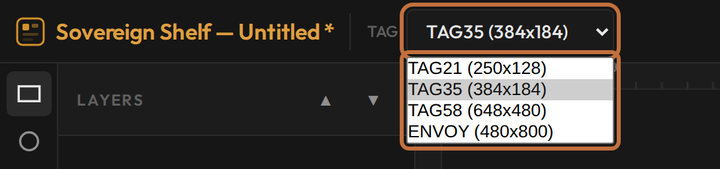
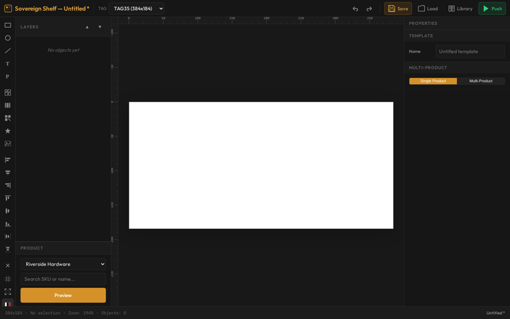
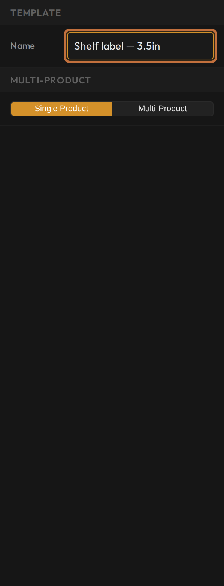
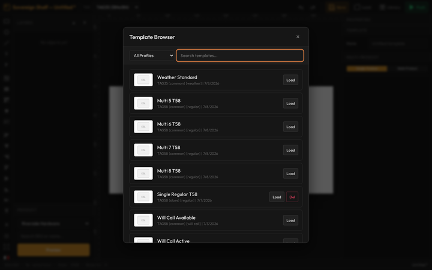

# Tour the Designer

**You'll learn:** how to open the Template Designer, pick a label size, find your way around the workspace, and save and reopen your work.

**Before you start:**

- You're signed in to the Guardian console — see [Sign in to your Guardian console](../../getting-started/a3-sign-in.md).
- You're on a desktop or laptop computer. The Designer does not run on phones or tablets — they show a "Desktop Only" screen and stop there.

!!! video "Watch: Tour the Designer (~6 min)"
    Video coming soon — the written steps below cover everything.

## Open the Designer

The Designer always opens from the console's Templates page. There is no separate address to type.

1. Click **Templates** in the console's menu.
2. Choose how you want to start:
    - Click **+ New template** to start a blank design.
    - Click **Edit** on a template's card to change that design.
    - Click **Open Designer** in the header to open the Designer empty.
3. The Designer opens in a new browser tab and fills the whole window.

## Pick the label size first

Every template is drawn for one exact label size, so set the size before you draw anything.

1. Find the **Tag** dropdown in the top toolbar.
2. Pick your label size. Each option shows a size code and the label's size in pixels: TAG21 is the 2.1-inch label, TAG35 is the 3.5-inch, and TAG58 is the 5.8-inch.
3. Watch the white canvas resize to match.

<!-- REVIEW: the size dropdown also shows an ENVOY option — hide or gloss pending the product decision -->

!!! warning "Choose the size before you draw"
    Changing the size later does not shrink or grow what you've already drawn — the label area simply resizes underneath your objects. Pick the size first and save yourself a redo.

## Get to know the workspace

The screen has five areas:

- **Top toolbar** — the Tag size dropdown plus **Undo**, **Redo**, **Save**, **Load**, and **Library** (ready-made designs from the Sovereign Shelf template library).
- **Left tool strip** — the object tools: text, shapes, pictures, barcodes, and more. The next lessons cover these one by one.
- **Left panel** — the **Layers** list and a product preview panel. Objects on a label stack on top of each other, like paper cutouts — the Layers list shows that stack, with the top item in front. The product panel below it previews your design with a real product; see [Preview with real products](c10-preview-with-real-products.md).
- **Centre: the canvas** — the white rectangle is your label at actual size, sitting on a dark work surface. Rulers along the edges measure in pixels.
- **Right: the Properties panel** — the settings for whatever you have selected. Click a text box and you get text settings; click a shape and you get shape settings.

The Properties panel has one trick to learn now. When *nothing* is selected, it shows **Template Parameters** — the settings for the template as a whole, including its name.

!!! tip "Can't find Template Parameters? Click the dark background"
    This trips up almost everyone. If the right panel is showing an object's settings, click any empty spot on the dark work surface around the label. That deselects everything, and Template Parameters comes back.

## Name your template

1. Click an empty spot on the dark background so nothing is selected.
2. Find the **Name** box in the **Template Parameters** panel on the right.
3. Type a clear name — something you'll recognise on the Templates page later, like "Shelf price 3.5".

## Save your work

1. Press **Ctrl+S**, or click **Save** in the top toolbar.
2. On the first save, a **Save Template To** dialog asks where to save. On a single-store Guardian your store is already selected — just confirm.
3. Watch for the green "Template saved" message.

The title bar shows the template's name. An asterisk (*) next to it means you have unsaved changes — it disappears when you save.

To make a copy under a new name, use **Save As** (Ctrl+Shift+S). It asks for the new name, then saves a separate template and leaves the original untouched.

??? note "If saving fails"
    If your Guardian can't be reached when you save, the Designer keeps your work in the browser on that computer only and shows a "Saved locally" message. These templates show "(local)" in the template list and do not exist anywhere else yet. Once the connection is back, open the template and save it again to store it on your Guardian.

## Open a saved template

1. Click **Load** in the top toolbar. The Template Browser opens, listing every template stored on your Guardian with its size and last-edited date.
2. Filter by size or search by name to narrow the list.
3. Click a row to open that template. The size dropdown and canvas switch to match it automatically.

Be careful with the **Del** button in this list: it deletes a template permanently after a single confirmation. There is no undo.

## Check your work

- Your template has a name — it shows in Template Parameters and in the title bar.
- There is no asterisk in the title bar, so everything is saved.
- Back on the console's Templates page, your template appears as a card.

## If something looks wrong

- **The right panel won't show Template Parameters** — an object is still selected. Click an empty spot on the dark background around the label.
- **A "Desktop Only" screen appears** — you opened the Designer on a phone or tablet. Switch to a desktop or laptop computer.
- **A "Saved locally" message appears when you save** — the Designer can't reach your Guardian. Your work is safe in this browser, but only on this computer. Save again once the connection is back.
- **Your template isn't on the console's Templates page** — check the Designer's Template Browser. If the template shows "(local)", it hasn't reached your Guardian yet — open it and save again.

**Next:** [Add text](c03-text-and-paragraphs.md).
