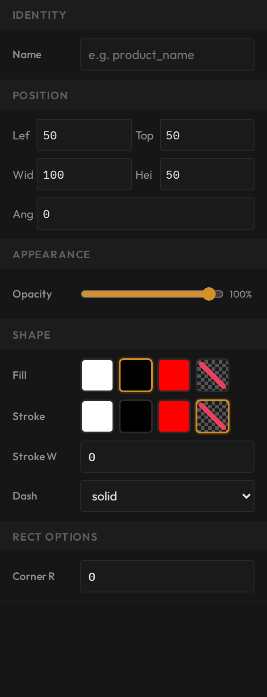
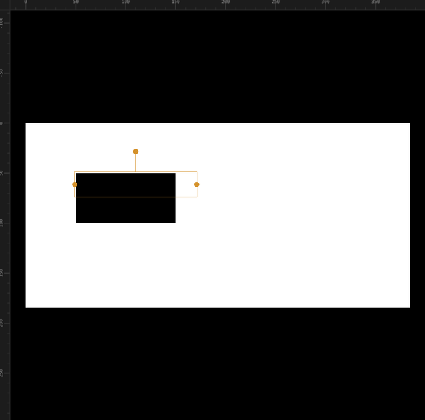

# Draw shapes and use the three colours

**You'll learn:** how to draw rectangles, circles, and lines — and how to design for the only three colours a shelf label can print: white, black, and red.

**Before you start:**

- The Designer is open — see [Tour the Designer](c02-designer-tour.md).
- You're on a desktop computer — the Designer does not run on phones or tablets.

Shapes are the quiet workhorses of a good label. A black bar behind a white price makes it pop. A thin line separates the product name from the numbers. A red rectangle says *sale* before anyone reads a word. There are only three shape tools, and they all work the same way.

## Draw a rectangle or circle

1. Click **Rectangle** or **Circle** on the left tool strip. The shape appears on the label, solid black — every shape starts black.
2. Drag it into place, and drag its handles to resize it. For exact numbers, use the **Position** boxes in the Properties panel instead (more on those below).
3. With the shape selected, open **Properties > Shape** on the right:
    - **Fill** — the colour inside the shape: **White**, **Black**, **Red**, or **None**. None means hollow — whatever is behind the shape shows through.
    - **Stroke** — the colour of the outline, with the same four choices.
    - **Stroke W** — how thick the outline is.
    - **Dash** — draw the outline solid, dashed, or dotted.
4. Rectangles get one extra control: **Corner R** rounds the corners. A bigger number means rounder corners — handy for a soft price badge.

## Draw a line

1. Click **Line** on the tool strip. A black line appears.
2. Drag it into position. To place it precisely, use **Properties > Line**: **Start X/Y** sets where the line begins, and **End X/Y** sets where it ends.
3. The line's stroke colour, width, and dash style work exactly like a shape's outline.

Lines are perfect separators — a thin rule between the product name and the price keeps a busy label readable.

## Controls every object shares

Every object on the canvas — shapes, lines, text, all of them — shares three sections in the Properties panel:

- **Identity > Name** — give the object a name. That name shows in the **Layers** list on the left, which stacks everything on your label. Three objects called "Rectangle" make the list a guessing game; "Price background", "Divider", and "Sale badge" make it readable.
- **Position** — **Left**, **Top**, **Width**, **Height**, and **Angle**. Type numbers here for exact placement, and use Angle to tilt an object.
- **Appearance > Opacity** — a slider that makes the object see-through on screen. Remember that the label itself prints only three solid colours, so before you trust a faded look, check it with the colour preview below.

## Think in three colours: white, black, and red

Here's the biggest idea in label design: **a shelf label is not a computer screen.** It prints exactly three colours — white, black, and red. Nothing else exists on the shelf.

The Designer keeps you honest: every colour swatch offers only those three (plus None). But colour can still sneak in from elsewhere — for example from a picture, which a coming-soon lesson covers. At print time, every sneaked-in colour snaps to the **nearest** of the three. Greens and blues become black or white, and which one they land on is hard to predict.

The sanity check is one click away:

1. Click the three-swatch **colour preview** button on the tool strip. It's labelled **WBR** — short for white, black, red.
2. Everything on the canvas snaps to the three printable colours. What you see now is what the tag will print.
3. Click the button again to go back to normal editing.

!!! tip "Red is your accent"
    With only three colours, red is precious. Save it for sale prices and things that must catch the eye, and keep body text black on white. A label that's mostly red shouts everything — and says nothing.

## Check your work

- You drew a rectangle, changed its **Fill** to red, and rounded its corners with **Corner R**.
- You renamed an object in **Identity > Name** and spotted that name in the Layers list.
- You placed a line exactly where you wanted it using **Start X/Y** and **End X/Y**.
- With the colour preview on, the canvas looks exactly how you'd accept the printed tag.

## If something looks wrong

**Your shape seems to have vanished** — its Fill and Stroke may both be **None**, or it's white on the white label. Click its row in the Layers list to select it, then pick a visible colour.

**A shape is covering your text** — it's stacked in front. In the Layers list, drag the text above the shape, or the shape below the text. More stacking tricks in [Layout like a pro](c09-layout-like-a-pro.md).

**A colour changes when the preview is on** — that colour isn't pure white, black, or red, so it snaps to the nearest one at print time. Recolour the object using the swatches and it will print true.

**You can't click a small object** — select it from the Layers list instead. Naming your objects makes this painless.

**Next:** [Add pictures and image placeholders](c06-pictures-and-image-placeholder.md)
