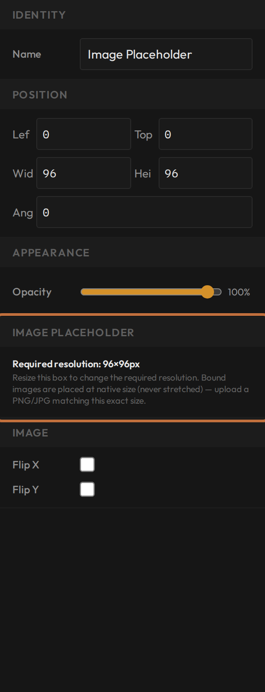
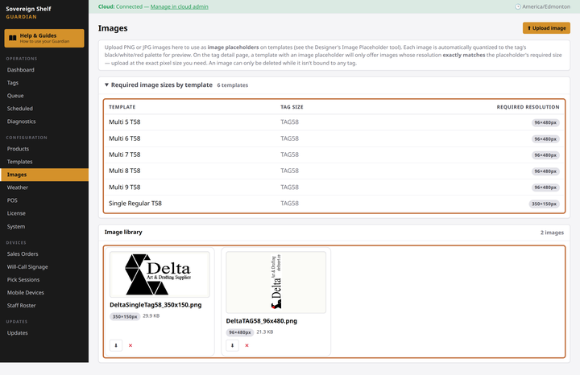
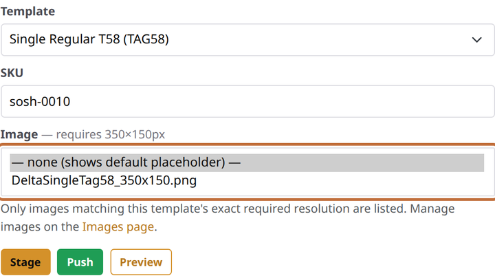

# Add pictures and image placeholders

**You'll learn:** how to put a picture on a label — a fixed one like your logo, or a placeholder whose picture you choose tag by tag.

**Before you start:**

- You know your way around the Designer ([Tour the Designer](c02-designer-tour.md)).
- Have a PNG or JPG ready — your logo is the classic first candidate.

There are two ways to use pictures, and they solve different problems. A **fixed picture** is part of the design itself: your logo, a brand mark, a decorative flourish — the same on every tag that uses the template. An **image placeholder** is an empty picture frame in the design: the frame's spot and size are fixed, but the actual picture is chosen later, tag by tag, when the tag is bound. One template, many pictures.

## Set your expectations first

A shelf label draws with exactly three colours — white, black, and red ([the three-colour rule](c05-shapes-lines-and-colours.md)). Any picture you add gets flattened to those three at print time. Logos and simple graphics survive this beautifully; photographs come out posterised, like a screen-print poster. The Designer shows you the flattened result before anything reaches a shelf, so nothing is a surprise — but pick artwork with bold, simple shapes and you'll be happiest.

## Add a fixed picture

1. In the Designer's toolbar, click **Image Library**. A grid of your uploaded pictures opens — empty on your first visit.

2. Click **Upload New** and pick your file. A crop dialog opens, locked to your label's proportions — drag to frame the part you want, or keep the image exactly as it is (the right call for logos).

    !!! screenshot "Screenshot: Image Library modal with the crop dialog open over an uploaded logo"
        To capture: assets/designer/image-library-crop.png

3. Here's the step everyone misses: **uploading doesn't place the picture.** Your file is now *in the library*, but not *on the label*. Click its thumbnail in the grid to place it on the canvas.

4. Move and resize it like any other object. The thumbnail previews already show the three-colour version, so what you see is what prints.

## Add an image placeholder

1. In the toolbar, click **Image Placeholder** — the dashed-border frame. A placeholder frame lands on the canvas. A template can hold **one** placeholder; the button politely refuses a second.

2. Size and position the frame. Now the important part: with the frame selected, the Properties panel shows a **Required resolution** read-out. The frame's size *is* the rule — any picture bound into this frame must be uploaded at exactly that pixel size. Resize the frame and the required size changes with it, so settle the frame's size early and leave it alone.

    

3. Save the template. The frame keeps its default graphic until a real picture is chosen — a tag never shows an empty hole.

## Choose the picture, tag by tag

The placeholder gets its picture at bind time, on the Guardian console:

1. Click **Images** in the console's left menu. This page is where the store's pictures live — upload, browse, and delete, with a reference table showing each template's required resolution so you know exactly what size to prepare.

    

2. On any tag's page, pick a template that has a placeholder — an **Image** dropdown appears on the bind form, listing only the pictures whose size exactly matches. Pick one, bind as usual.

    

Staff can do the same from their handhelds — the Edit sheet on the [tag-update lesson](../../staff/f3-update-a-shelf-tag.md) has the matching Image picker.

??? note "Why the size must match exactly"
    The placeholder never stretches or squeezes a picture — pixels print exactly as uploaded, which is what keeps artwork crisp on a three-colour screen. That's why the dropdown filters to exact matches instead of letting a wrong-sized image in and mangling it. The Images page's reference table exists so you can prepare files at the right size the first time.

## Check your work

- Your fixed picture shows on the canvas in its three-colour form, and survives a save and reload.
- With the placeholder template selected on a tag's bind form, the **Image** dropdown appears and lists your correctly-sized upload.

## If something looks wrong

**My picture isn't in the Image dropdown** — its size doesn't exactly match the placeholder frame. Check the required resolution on the **Images** page, re-export your file at that size, upload again.

**My logo looks blotchy on the label** — that's the three-colour flattening. Use a version of your logo with solid shapes and high contrast rather than gradients or fine shading.

**I uploaded a picture but the canvas didn't change** — uploading and placing are two steps. Open **Image Library** again and click the thumbnail.

**I can't delete a picture from the Images page** — it's currently on a tag. Rebind or unbind that tag first.

**Next:** [Add barcodes and QR codes](c07-barcodes-and-qr-codes.md)
