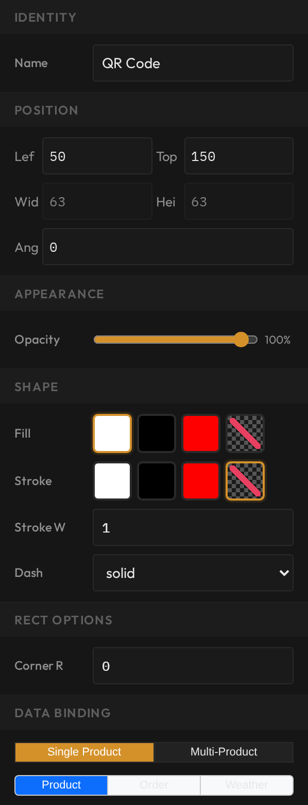

# Add barcodes and QR codes

**You'll learn:** how to put a scannable barcode and a QR code on a template, and how to make a QR code open a web page.

**Before you start:**

- The Designer is open — see [the Designer tour lesson](c02-designer-tour.md).
- You know how data binding works — see [Show live product data](c04-show-live-product-data.md).
- You're on a desktop computer — the Designer does not run on phones or tablets.

Barcodes and QR codes turn a shelf label into something a scanner can read. A barcode lets staff ring up or look up the product with a handheld scanner. A QR code can hold more — like a web address a customer scans with their phone. Both come out of the Designer already bound to live product data, so one template works for every product.

## Add a barcode

1. Click the **Barcode** button on the left tool strip. A live barcode appears on the canvas, already bound to the product's barcode (UPC) field. You don't have to set anything up — at print time, each label draws its own product's barcode.
2. Drag it into place like any other object.
3. To make the bars taller or shorter, use **Position > Height** in the Properties panel. The barcode's **width sets itself** from the data inside it — you can't drag it wider or narrower. Scanners need the bars at exact widths to read them, so the Designer protects that for you.
4. In **Properties > Barcode**, the **Static Data** box holds a fixed fallback value. If a product doesn't have a barcode on file, the label prints this value instead of an empty gap. You can also use Static Data alone for a barcode that never changes, like a store coupon code.
5. Watch the barcode on the canvas — it redraws live as the data changes, so what you see is what will print.

## Add a QR code

1. Click the **QR Code** button on the tool strip. A live QR code appears, already bound to the product's SKU.
2. In **Properties > QR Code**, set the size with **Target Size**, measured in pixels. QR codes only come in certain exact sizes, so the square snaps to the nearest clean size — and the corner handles are locked, because dragging would blur the pattern and break scanning.
3. **Error Level** (L, M, Q, or H) trades size for toughness. A QR code carries built-in spare data so it still scans when part of it is dirty or blocked. **L** makes the smallest, simplest code; **H** survives about 30% of the code being damaged, but packs the squares in tighter. On a clean indoor shelf, the default **L** is fine.
4. Like the barcode, **Static Data** holds a fixed fallback used when the product lacks the bound field.

!!! tip
    Bigger is easier to scan. If shoppers will scan the QR code from arm's length, give it room — a generous Target Size beats a high Error Level.

## QR codes that open a web page

A QR code doesn't have to hold just a SKU. Wrap a web address around the bound value with **Prefix** and **Postfix** (the same boxes you met in [the data binding lesson](c04-show-live-product-data.md)), and every label becomes a scannable link to that product's page on your website.

1. Select the QR code.
2. In **Data Binding**, keep the field set to the product's SKU.
3. Type the front of the web address into **Prefix** — for example `https://yourstore.com/p/`.
4. Add a **Postfix** if your address needs a tail — for example `?ref=shelf`.

Worked example: a product with SKU `10442` and a Prefix of `https://yourstore.com/p/` prints a QR code that opens `https://yourstore.com/p/10442`. Every other product's label builds its own link the same way, automatically.

??? note "Match the address to your website"
    The Prefix has to match how your website actually finds products. Test one address in your own browser first — swap a real SKU into the pattern and make sure the product page loads — before you push labels to the whole store.

## Check your work

- [Preview with a real product](c10-preview-with-real-products.md) — the barcode and QR code should show that product's real data, not the sample.
- Scan the printed barcode with a handheld scanner — it should read back the product's barcode number.
- Scan the QR code with a phone camera — it should show the SKU, or open your product page if you built a web link.

## If something looks wrong

- **The barcode won't resize sideways** — that's by design. Width is automatic; adjust the height in Position > Height instead.
- **The QR code is too small to scan** — raise the Target Size, or lower the Error Level so the pattern is less dense.
- **The label prints an unexpected code** — the product is missing the bound field, so the Static Data fallback printed. Check the product in your POS, or update the Static Data value.

**Next:** [Add icons and conditional rules](c08-icons-and-conditional-rules.md).
