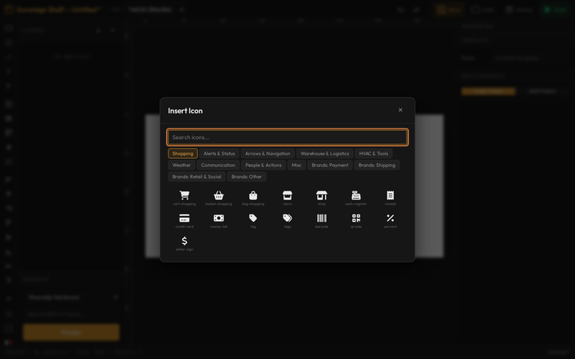
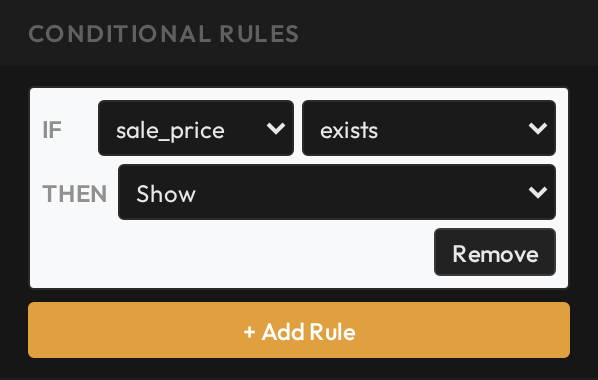

# Add icons and smart show/hide rules

**You'll learn:** how to place icons on a label and attach IF/THEN rules so parts of your design appear only when the product's data calls for them.

**Before you start:**

- The Designer is open — see [the Designer tour lesson](c02-designer-tour.md).
- You know how to bind an object to a data field — see [Show live product data](c04-show-live-product-data.md). Rules are built from the same data fields.
- You're on a desktop computer — the Designer does not run on phones or tablets.

This lesson covers two features that make a template feel smart. Icons give your labels quick visual cues — a truck for shipping, a warning triangle, a payment mark. Conditional rules go further: they let one template change what it prints depending on the product, so a SALE badge shows up only when there is actually a sale.

## Add icons

1. Click the star (**Insert Icon**) button on the left tool strip. The icon picker opens.
2. Find your icon. Type a word in the search box, or browse the category tabs — Shopping, Alerts & Status, Arrows & Navigation, Warehouse & Logistics, Weather, People & Actions, and more. Brand logos, like payment and shipping marks, live under the Brands tabs. There are about 180 icons in all.
3. Click an icon to place it on the canvas. It arrives black.
4. With the icon selected, open **Properties > Icon** to style it:
    - **Size** — icons size like text. The Size box is a font size, so a bigger number means a bigger icon.
    - Colour — pick white, black, or red from the swatches. Those are the three colours a label can print.
    - **Change Icon** — reopens the picker so you can swap the picture without redoing its position or rules.

??? note "Icons can be bound to data too"
    Like text, an icon can be bound to a data field in **Properties > Data Binding**. If the field carries an icon name, the icon swaps automatically at print time. Most price labels never need this — it exists for special layouts where the picture itself comes from the data.

## Conditional rules — the magic

A conditional rule is an IF/THEN sentence your label follows every time it prints. *IF the product has a sale price, THEN show this badge.* Any object with a Data Binding section can carry rules — text, paragraphs, barcodes, QR codes, icons, and pictures. Rules are checked at print time, so the same template makes different-looking labels for different products.

1. Select the object, then expand **Conditional Rules** in the Properties panel. It starts collapsed — click its header to open it.
2. Click **+ Add Rule**.
3. Build the IF part:
    - Pick a **data field** — anything from the field list, like the sale price or the stock quantity.
    - Pick an **operator**: equals, not equals, greater than or less than (with or-equal versions), contains, is in a list you type (comma-separated), has a value, or exists.
    - Type the **value** to compare against. For *has a value* and *exists* there is nothing to compare, so the value box disappears.
4. Build the THEN part — what happens when the IF matches: **Show**, **Hide**, **Swap icon** (opens the icon picker), **Set text**, or **Set badge**.
5. Click **+ Add Rule** again for more rules, or **Remove** on a rule to delete it.

## Build it: a SALE burst that only prints during a sale

1. Click **Insert Icon** and place a burst — the classic starburst badge shape. Set its colour to red and size it to suit a corner of your label.
2. With the burst selected, expand **Conditional Rules** and click **+ Add Rule**.
3. IF: pick the **sale price** field and the **exists** operator. The value box disappears — you're just asking "does this product have a sale price?"
4. THEN: pick **Show**.
5. Done. The burst prints only while the product has a sale price. On every tag whose product has no sale, the burst stays hidden and the rest of the layout prints as usual.

One more quick example: add a small red text object reading `LOW STOCK`, then give it a rule — IF **stock quantity** is **less than** `5` (or whatever number worries you) THEN **Show**. Shelves quietly flag themselves before you run out.

!!! tip
    Rules run at print time, not on the canvas — the Designer canvas always shows the object. To see both looks, use the [real-product preview](c10-preview-with-real-products.md) twice: once with a product that's on sale, once with one that isn't.

## Check your work

- Preview with an on-sale product — the red SALE burst appears in the picture.
- Preview with a product that isn't on sale — the burst is gone, and the layout still looks right without it.
- Select the burst and confirm Conditional Rules shows one rule: IF sale price exists THEN Show.

## If something looks wrong

- **The burst prints on every tag** — select it and check Conditional Rules. An object with no rules always prints; make sure the rule reads IF sale price *exists* THEN *Show*.
- **The burst never prints** — preview with a product that is genuinely on sale right now. If it still hides, re-check the field and operator in the IF line.
- **I can't find Conditional Rules** — select the object first, then look in the Properties panel; the section is collapsed until you click it. Plain shapes and lines don't have it — only objects that can be bound to data.
- **My icon is the wrong size and hard to adjust** — use the **Size** box in Properties > Icon. Icons size like text, so treat that number as a font size.

**Next:** [Layout like a pro](c09-layout-like-a-pro.md).
