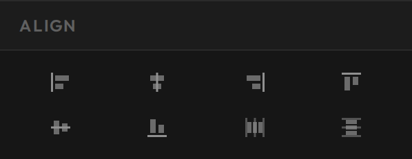
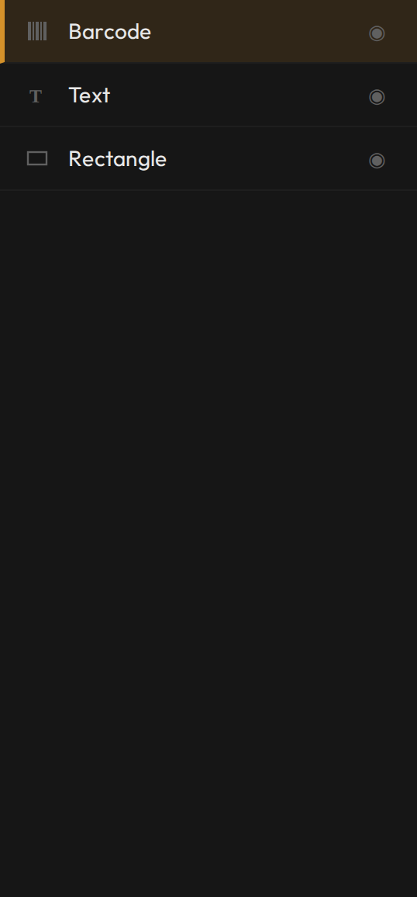

# Layout like a pro

**You'll learn:** how to line objects up perfectly, control what sits in front of what, and work twice as fast with keyboard shortcuts.

**Before you start:**

- The Designer is open with a template that has a few objects on it — see [Tour the Designer](c02-designer-tour.md).
- You're on a desktop computer — the Designer does not run on phones or tablets.

!!! video "Watch: Layout like a pro (~4 min)"
    Video coming soon — the written steps below cover everything.

Shoppers may never notice a perfectly aligned label — but they always notice a crooked one. The good news: you never have to eyeball it. The Designer has tools that line things up for you.

## Select and align

To arrange several objects at once, you first select them together:

1. Hold **Shift** and click each object, or drag a box around them on the canvas.
2. With two or more objects selected, an **Align** section appears in the Properties panel on the right. The same buttons also live on the left tool strip.
3. Click an align button to snap the selection into line: **Left**, **Center H**, or **Right** lines up sides and centres across the label; **Top**, **Center V**, or **Bottom** does the same up and down.
4. Select **three or more** objects and the **Distribute Horizontal** and **Distribute Vertical** buttons come into play — they even out the gaps between the objects, so a row of icons or prices is spaced perfectly.

Two more helpers work while you drag a *single* object:

- **Smart guides.** As you drag, amber lines flash on the canvas whenever your object lines up with another object's edge or centre, or with the edge of the label itself — and the object snaps gently to that line. Most of the time, smart guides are all the alignment you need.
- **The grid.** Click **Toggle Grid** on the tool strip to lay a 10-pixel grid over the label. While the grid is on, dragging snaps to it — handy for keeping rows of text on the same tidy lines.

## Layers

Objects on a label stack like paper cut-outs on a table: whatever you added last sits on top, covering whatever is underneath. The **Layers** panel on the left is the list of that stack.

1. Every object gets a row in the Layers panel. The **top row is the frontmost object** on the label; the bottom row is the one furthest back.
2. Drag a row up or down (or use the up/down buttons) to restack — for example, drag your price text above the black rectangle behind it.
3. Click the **dot** on a row to hide or show that object — useful for getting clutter out of the way while you work on something underneath.
4. Click any row to select that object — the easiest way to grab something tiny or buried.
5. Name your objects in **Identity > Name** in the Properties panel. A list that reads "Price background, Product name, Sale badge" beats one that reads "Rectangle, Rectangle, Text".

You can also **right-click any object** on the canvas for a quick menu: **Copy**, **Paste**, **Duplicate**, **Delete**, **Bring to Front**, **Send to Back**, **Group/Ungroup**, and **Lock**.

- **Group** ties several objects together so they move and resize as one — great for a price block you've already lined up.
- **Lock** stops an object from being moved or resized until you unlock it.

!!! tip "Lock your background"
    Built a full-label background rectangle? Lock it. Otherwise every click meant for the text on top grabs the background instead — locking it makes the rest of the design painless.

## The shortcuts worth learning

You can do everything with the mouse, but these few shortcuts pay for themselves in the first hour:

| Press | What it does |
|---|---|
| **Ctrl+S** | Save the template |
| **Ctrl+Z** / **Ctrl+Shift+Z** | Undo / redo |
| **Ctrl+D** | Duplicate the selected object |
| **Ctrl+G** / **Ctrl+Shift+G** | Group / ungroup the selection |
| **Arrow keys** | Nudge the selection 1 pixel |
| **Shift + arrow keys** | Nudge 10 pixels |
| **Scroll wheel** | Zoom in and out, toward your cursor |
| **Alt + drag** | Pan around the canvas |
| **Double-click the dark background** | Recentre the label in view (**Fit to View** on the tool strip does the same) |

For fine placement, nudge — don't drag. Arrow keys move exactly 1 pixel at a time, which is how you win the last little adjustment.

??? note "How far undo reaches"
    The Designer remembers your last 40 actions. Also, redo only survives while you haven't done anything new: undo a few steps and then move an object, and the redo trail is cleared. Save often with **Ctrl+S**.

## Check your work

- Toggle the grid on: your prices and product names sit on the same lines instead of drifting.
- Select three objects and click **Distribute Horizontal** — the gaps between them come out even.
- The Layers list reads like a sensible parts list of named objects, top row matching the frontmost thing on the label.

## If something looks wrong

**An object won't move or resize** — it's probably locked. Right-click it and choose **Lock** again to unlock it.

**Distribute doesn't seem to do anything** — it needs at least three objects selected. With two, use the align buttons instead.

**An object disappeared** — check its row in the Layers panel. Its visibility dot may be off, or it slid behind a bigger object — right-click it and choose **Bring to Front**.

**Undo won't go back far enough** — history holds 40 steps, and nothing more. When a design reaches a state you like, save it.

**Next:** [Preview with real products](c10-preview-with-real-products.md).
