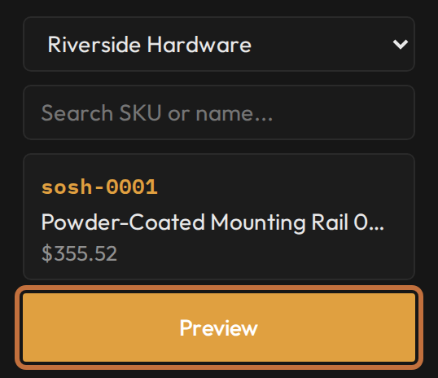
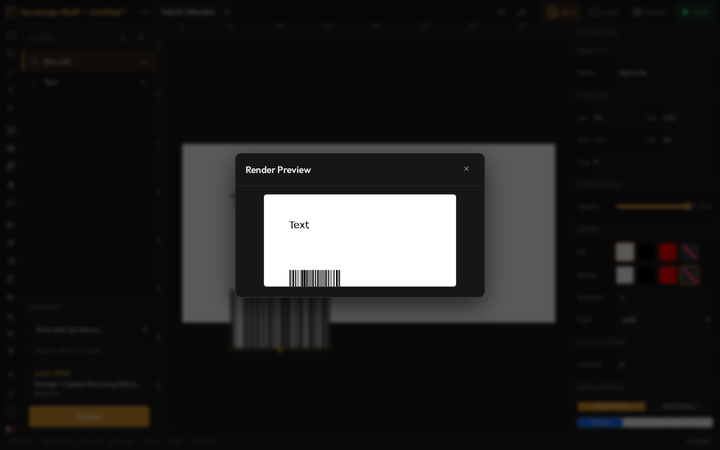

# Preview with real products

**You'll learn:** how to render your template with a real product from your store, so you see the exact image a tag will receive before anything touches the shelf.

**Before you start:**

- The Designer is open — see [the Designer tour lesson](c02-designer-tour.md).
- You're on a desktop computer — the Designer does not run on phones or tablets.
- Products are synced from your point-of-sale system (POS) — see [Connect your product data](../../getting-started/a4-connect-your-product-data.md). On a brand-new Guardian with an empty catalogue, the Preview button stays disabled.

Sample text on the canvas only gets you so far. Real products have longer names, missing fields, and sale prices your sample never had. This lesson shows you how to test against the real thing.

## Pick a real product

1. Find the **Product** panel on the left side of the Designer, below the Layers list.
2. In its search box, type at least 2 characters of a SKU or a product name. Matches appear as you type.
3. Click a result. Its SKU, name, and price appear in the panel, and the **Preview** button lights up.

## Open the preview

1. Click **Preview**.
2. A popup opens with a picture of your label. This is not a rough sketch — it is the exact image the tag would receive, produced by the same print engine that handles a real update. If it looks right here, it will look right on the shelf.
3. Close the popup, adjust your design, and preview again as often as you like. Previewing never touches a tag.

## Test the tricky cases

One good-looking preview is not enough. Search for these three products and preview each one:

1. **Your longest product name.** Single-line text clips at the edge of its box, and paragraphs can run out of lines. A long name is where layouts break first.
2. **A product on sale.** Check that sale prices and any sale-only objects show up the way you planned.
3. **A product missing a field you bound.** A bound text object whose product lacks the field prints **blank** — the sample text simply disappears. Preview one of these so you know what that gap looks like. [Show live product data](c04-show-live-product-data.md) explains the fallback rules for each object type.

!!! tip "A rough check without a product"
    For a quick colour sanity check, click the three-swatch **WBR** colour-preview button on the tool strip — short for white, black, red, the only colours a label can print. It snaps the whole canvas to those printable colours. Click it again to switch back. See [Shapes, lines, and colours](c05-shapes-lines-and-colours.md). It doesn't use product data — for that, use the Preview button.

## The one trap on this screen

!!! warning "The toolbar's Push button does not push"
    The **Push** button in the top toolbar opens a dialog where **Render Preview** works — but its **Push to Tag** button is disabled on your Guardian. That is by design. Templates reach real tags by being [bound to a tag](../../getting-started/a5-bind-your-first-tag.md) or [set as a store default](c12-sale-layouts-and-defaults.md) — never from inside the Designer.

??? note "Designing a will-call or order template?"
    Switch the **Data Binding** domain toggle from Product to **Order**. The left panel relabels itself to Order and searches by order number instead of SKU or name. The will-call lessons are coming soon.

## Check your work

- The preview of a normal product shows its real name and price, laid out the way you designed.
- Your longest product name fits — nothing important is clipped or dropped.
- An on-sale product previews with the sale information you expect.

## If something looks wrong

- **The Preview button is greyed out** — no product is picked yet, or your catalogue is empty. Pick a search result first, or [connect your product data](../../getting-started/a4-connect-your-product-data.md).
- **My search finds nothing** — type at least 2 characters, and check that the product exists in your POS and has synced.
- **A line in the preview is blank** — that product lacks the field you bound. See [Show live product data](c04-show-live-product-data.md) for what prints when a field is missing.
- **"Push to Tag" is greyed out in the Push dialog** — that's on purpose. Push by binding the template to tags or setting it as a default from the Guardian console.

**Next:** [Set sale layouts and store defaults](c12-sale-layouts-and-defaults.md). (The multi-product templates lesson is coming soon.)
