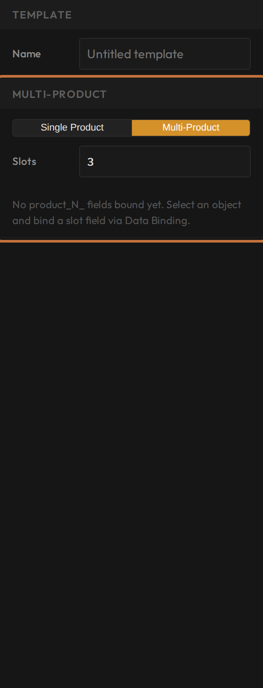
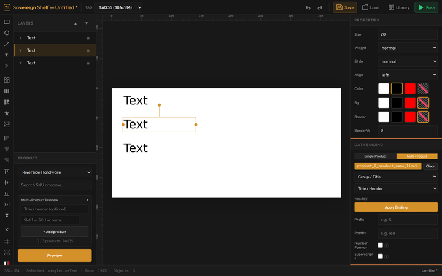
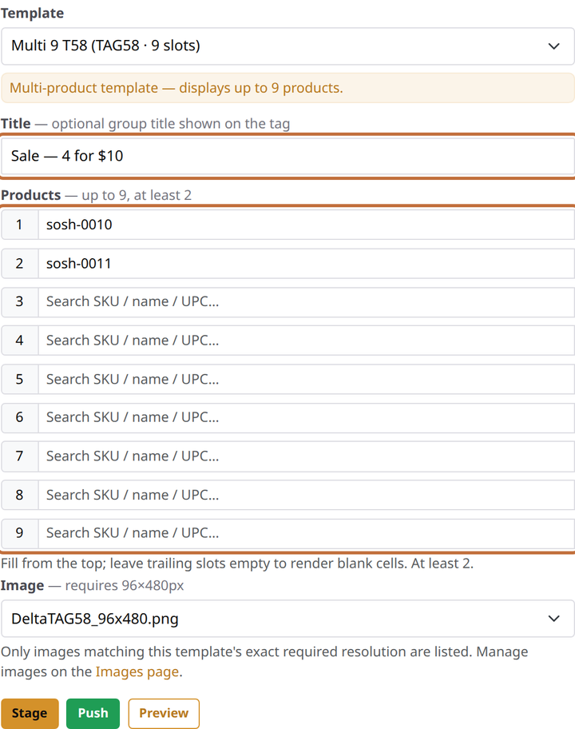

# Multi-product templates

**You'll learn:** how to design a label that shows several products at once, and how to load it up with products from the console.

**Before you start:**

- You can bind live product data to a design ([Show live product data](c04-show-live-product-data.md)) — this lesson builds directly on it.
- You have a larger tag to hand. The small 2.1" labels are single-product only; a 3.5" label holds up to **3** products, and a 5.8" up to **9**.

!!! video "Watch: Design a multi-product label (~5 min)"
    Video coming soon — the written steps below cover everything.

One tag, a whole shelf strip: paint colours, screw sizes, a family of spice jars. A multi-product template lays out numbered rows — and when *any* product in the group changes price, the whole label refreshes on its own.

## Make the template multi-product

How many products a design holds is a property of the **template**, decided in the Designer:

1. Open your template and click an empty spot on the canvas so nothing is selected. The right sidebar switches to the **Template Parameters** panel — the same panel where the template's name lives.

2. Turn on the **Multi-product** toggle and set the number of **slots** — how many products this design will show. The limit follows the label size you picked (up to 3 on a 3.5", up to 9 on a 5.8").

    

## Lay out the rows

Each text object now binds to a *numbered* product. In the Field dropdown you'll find **Product 1**, **Product 2**, and so on, each carrying the same fields you know from single-product designs — name, price, sale price.

The fast workflow:

3. Build one row: a name bound to *Product 1 — name*, a price bound to *Product 1 — price*, and any dividers.
4. Select the row, duplicate it (`Ctrl+D`), drag the copy into place, and re-point its bindings at **Product 2**. Repeat down the label.
5. Optionally add a text object bound to the **Title** field — a group heading like "Interior Paints" whose wording is typed in later, when the tag is loaded.

    

6. Preview it: the [preview panel](c10-preview-with-real-products.md) lets you pick a real product per row, so you can check every slot with real names and prices. Save when it looks right.

## Load it with products on the console

Designs come to life on a tag from the Guardian console:

1. Open the tag's page (Tags → find it by its 8-character code) and pick your multi-product template on the bind form. The form announces how many products the template displays, and unfolds into a **Title** box plus one numbered product box per slot.

2. Fill from the top, no gaps: type three or more characters in a product box and pick from the matches — or scan a barcode gun straight into the box; an unambiguous match fills itself in. Two products minimum; trailing boxes you leave empty simply print as blank cells, which is often exactly right.

    

3. Save. From the console this is a **staged** change — it's recorded, and the shelf updates on your store's next update run rather than instantly. (Staff phones push multi-product changes immediately; that's the floor's fast path — see [their lesson](../../staff/f4-multi-product-tags.md).)

??? note "Changing the line-up later"
    Re-assigning a multi-product tag always replaces the whole list — there's no swapping a single row. That's simpler than it sounds: the form pre-fills with the current line-up, so you edit the one row and save the lot.

## Check your work

- The Template Parameters panel shows your slot count, and the preview fills every row with a real product.
- After the tag updates, each row on the shelf shows its product, empty slots print as clean blank cells, and a price change to *any* product in the group refreshes the label on its own.

## If something looks wrong

**The Multi-product toggle is missing** — the template is on the 2.1" label size, which can't hold more than one product. Start a new template on a larger size (the size can't be changed after the fact).

**A row prints blank that shouldn't** — check the slot's binding number in the Designer (a duplicated row still pointing at Product 1 is the classic), then check the slot is actually filled on the tag's bind form. And remember: a blank *trailing* cell is [often correct](../../reference/faq.md).

**The shelf hasn't changed after saving on the console** — console changes are staged for the next update run, by design. Staff phones are the push-it-now path.

**Next:** [Put templates to work: purposes, sale pairs, and defaults](c12-sale-layouts-and-defaults.md)
