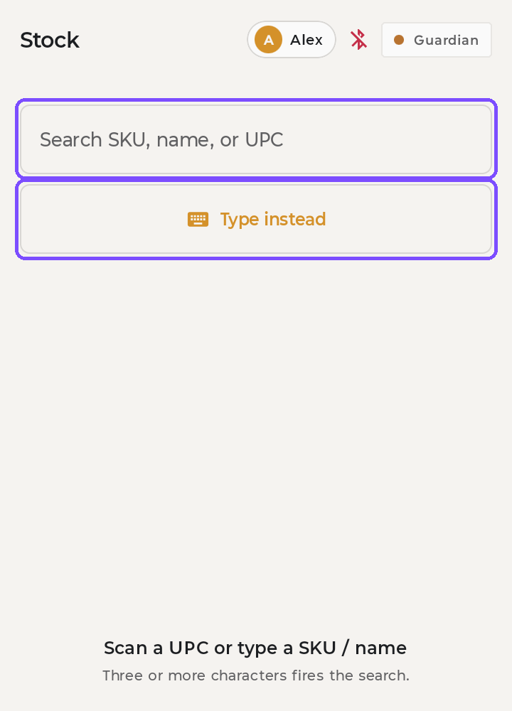
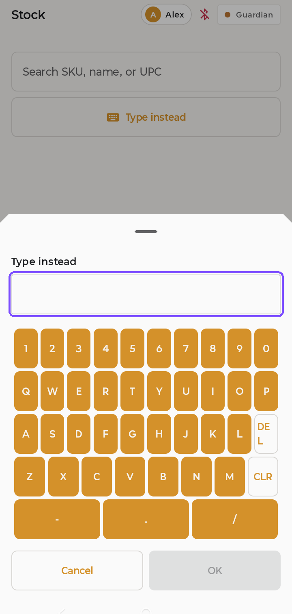
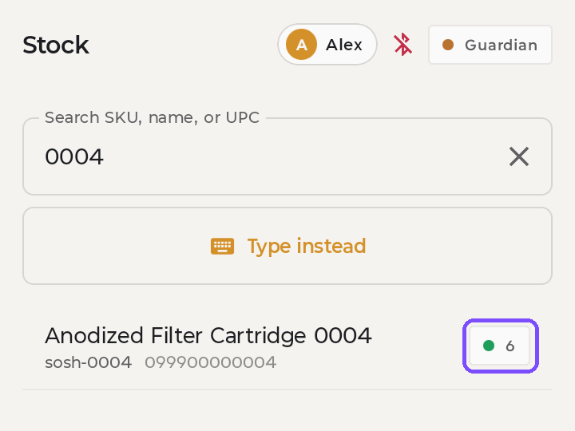
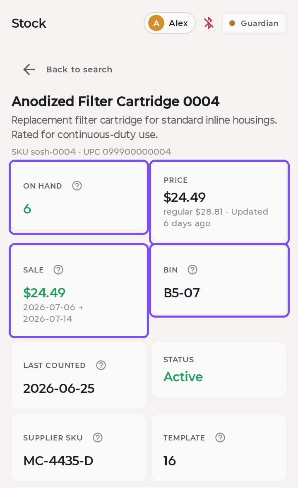
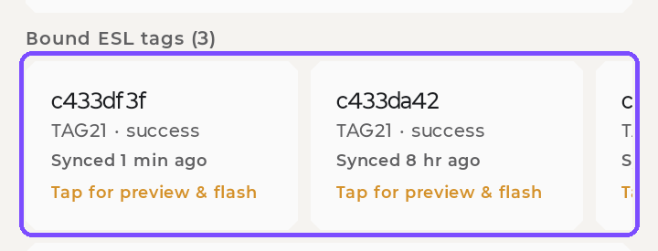
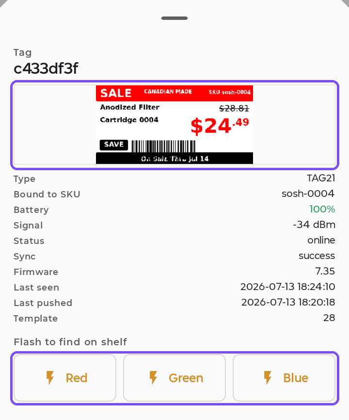

# Look up a product

**You'll learn:** how to find any product on the store handheld and see its price, stock, and shelf location in seconds.

**Before you start:**

- You have a store handheld, unlocked with the staff PIN. Ask your manager if you don't know it.

!!! video "Watch: Look up a product (~3 min)"
    Video coming soon — the written steps below cover everything.

## Find the product

1. Tap the **Stock** tab at the bottom of the screen.
2. Scan the product's barcode with the handheld's scanner. If it matches exactly one product, the app jumps straight to the product page — you're done searching.
3. Prefer to type? Tap the search box and enter part of the product's name, SKU, or barcode. The search fires as soon as you have typed **three characters**. Tap the result you want.

!!! tip "Keyboard not popping up?"
    Tap **Type instead**. The app opens its own on-screen keyboard. This happens when the barcode scanner blocks the phone's normal keyboard — it's not broken. Type your search, then tap **OK**.

Each result shows the product's name, SKU, and barcode, with a stock count on the right. The count is colour-coded, so you can judge availability before you even open the product: **green** means 5 or more, **amber** means 1 to 4, and **red** means none.

## Read the product page

The top of the product page is a grid of eight tiles:

- **On hand** — how many are in stock, colour-coded with the same green / amber / red rule as the search results.
- **Price** — the price the shelf tag will show. While a sale is on, this is the sale price, with the regular price and the time of the last update underneath.
- **Sale** — the sale price and the dates it runs between. With no sale on, it reads "no active sale".
- **Bin** — where the product lives in the store.
- **Last counted** — when this product's stock was last counted.
- **Status** — whether the product is still active in your catalogue.
- **Supplier SKU** — your supplier's own code for the product.
- **Template** — the tag layout this product uses by default.

Underneath the grid, **Stock detail** gives the reorder point and min/max levels, and **Product info** gives the vendor, category, and description.

??? note "More details"
    Tap the **More details** section at the very bottom of the page to see extra barcodes and other product fields. You won't need it often.

## Find its shelf tags

Scroll down to **Bound ESL tags**. There is a card for every tag this product is on — the heading tells you how many — and each card shows the tag's code, its type, and when it last synced.

1. Tap a card. Each one is labelled **Tap for preview & flash**. A panel slides up.
2. At the top of the panel is a picture of exactly what that tag is showing on the shelf right now, followed by its battery, signal, and firmware.
3. Under **Flash to find on shelf**, tap **Red**, **Green**, or **Blue**. The tag's light blinks on the shelf in that colour.
4. Walk toward the blinking light to find the tag.

## Reopen a recent lookup

1. Tap the **Home** tab. Your last few lookups are listed there.
2. Tap **More**, then **Recents** to see your last 50 scans.
3. Tap any item to reopen its product page.

!!! tip "No internet? No problem."
    Lookups work even when the store's internet is down. The app talks to your Guardian right inside the store.

## Check your work

- The product page shows a price and a colour-coded stock count.
- Tapping a tag card shows a picture that matches what's on the shelf.
- Tapping a flash colour makes that tag's light blink on the shelf.

## If something looks wrong

**"Tag offline" message when you flash** — the tag couldn't be reached right now. Try again in a minute, or tell your manager.

**Product not found** — it may not have synced from your point-of-sale system (POS) yet. Try again in a few minutes, or check the spelling.

**Next:** [Update a shelf tag](f3-update-a-shelf-tag.md)
