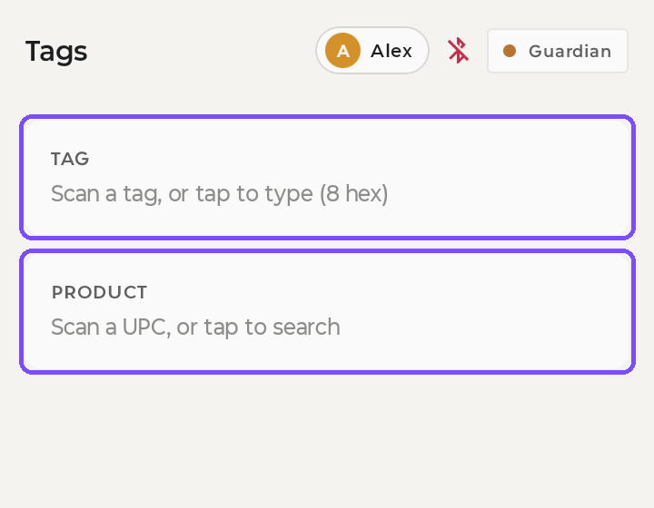
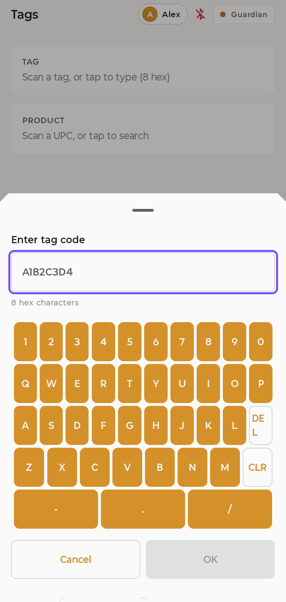
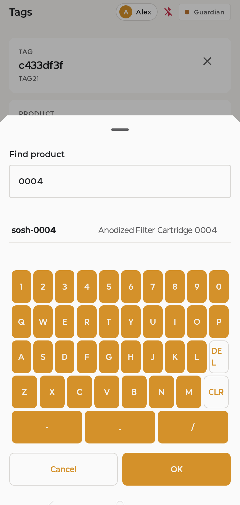
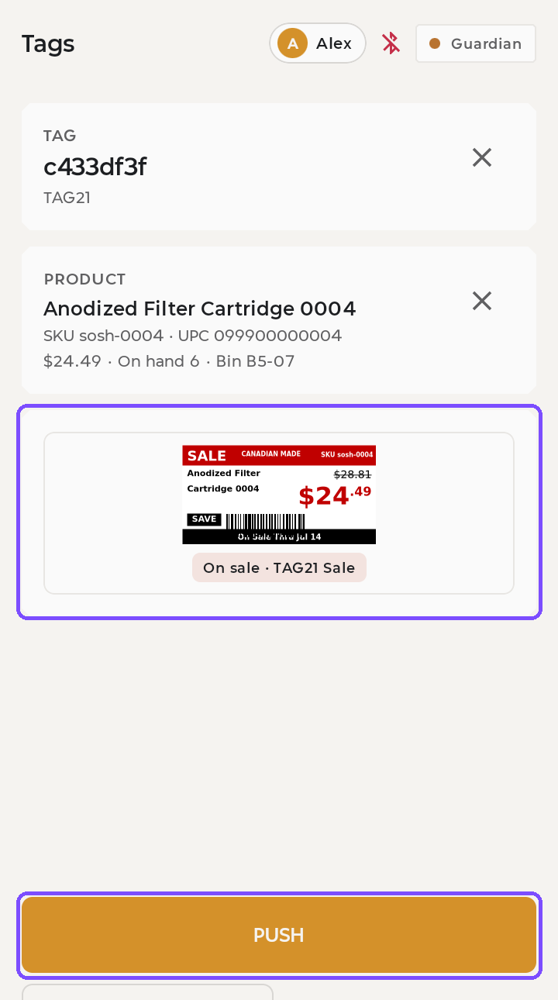
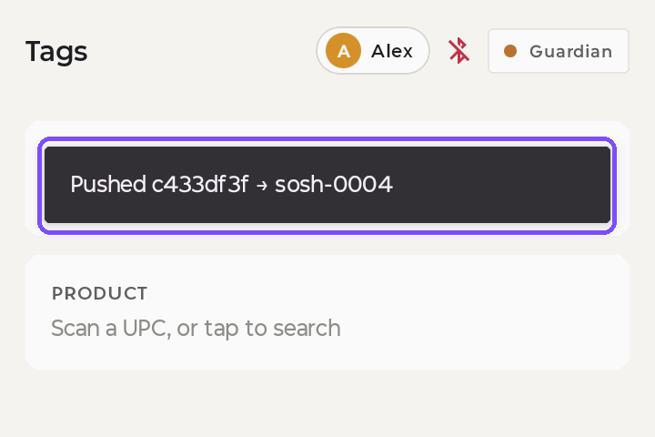
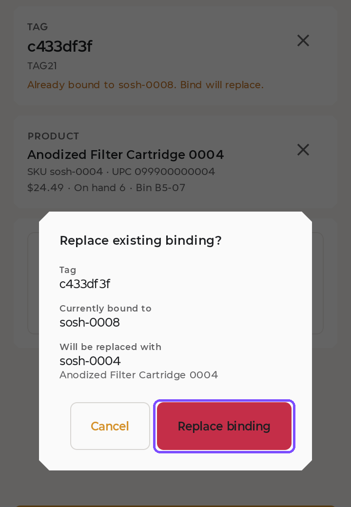

# Update a shelf tag

**You'll learn:** how to link a shelf tag to a product and send the new display to the shelf in moments.

**Before you start:**

- Your handheld is unlocked. If the lock screen is up, enter your staff PIN.
- You can see the **Tags** tab at the bottom of the screen. If it's missing, this feature is turned off for your store — ask your manager.

!!! video "Watch: Update a shelf tag (~4 min)"
    Video coming soon — the written steps below cover everything.

This is the job you'll do most. The app calls it a **bind** — link a tag to a product. Two scans, one button.

## Fill the two boxes

Tap the **Tags** tab. You get two empty boxes: **TAG** and **PRODUCT**.

1. Scan the tag's own barcode — the tag code, the 8-character code printed on the tag. The **TAG** box fills in with the code and the tag's type, such as `TAG21`.
2. Scan the product's barcode. The **PRODUCT** box fills in with the product's name, price, stock, and bin. Either order works — the app sends each scan to the right box automatically.

No scanner to hand? Tap either box and type the entry yourself. The app opens its own keyboard, so this works even when the barcode scanner has taken over the phone's normal one.

=== "Tapping the TAG box"

    **Enter tag code** wants the 8-character code from the tag. Type it, then tap **OK**.

    

=== "Tapping the PRODUCT box"

    **Find product** searches by SKU or name once you have typed at least three characters. Tap the product you want from the results.

    

## Check the preview, then push

Once both boxes are filled, a preview appears showing exactly what the tag will display. If the product is on sale, the sale layout is chosen for you — you'll see a note naming it, such as "On sale · TAG21 Sale".

1. Check the preview matches the product you meant.
2. Tap **PUSH** to send the update to the tag.
3. Listen for the beep. Success beeps and vibrates, and the tag on the shelf updates within moments.

The app confirms with a **Pushed** message naming the tag and the product, then clears both boxes so you're ready for the next one.

## Good to know

The app protects you from common slips:

- **Nothing is ever replaced silently.** If the tag is already bound to a different product, the TAG box warns you — *"Already bound to … Bind will replace."* — and tapping **PUSH** asks you to confirm before anything changes. If it seems like nothing happened, look for this question on screen.
- **A scan can land in the wrong box.** Some short product barcodes look like tag codes. If that happens, tap the **✕** on that box to clear it and scan again — or tap the empty box and type the entry in yourself.
- **A failed push keeps your work.** If the update fails, both boxes stay filled. Fix the problem and tap **PUSH** again — no rescanning.

!!! tip "PUSH now, Stage for later"
    **Stage** saves the change without sending it — the tag keeps showing the OLD price until your store's next update run. Use **PUSH** unless your manager says otherwise. **Cancel** clears both boxes and starts over.

One more button you may see: large tags can show several products at once — that's the **Multi-product** button, which gets [its own lesson](f4-multi-product-tags.md).

??? note "Choosing a different look (Edit)"
    Tap **Edit** before you push to change how the tag will look:

    - **Template** — the layout on the tag. Leave it on **Default (automatic)** unless you've been told to pick a specific one.
    - **Image** — if the chosen template has a spot for a picture, pick one here. Only images that are exactly the right size are offered.
    - **Purpose** — what the tag is used for: Price tag, Pick-by-light, Will-call, or Weather. Most tags are price tags.

    Tap **Done**, then **PUSH** as usual.

## Check your work

- The tag on the shelf refreshes to match the preview on your phone.
- Your phone beeped, vibrated, and showed the **Pushed** message.
- Scan the tag again — the **PRODUCT** box now finds it bound to the new product, and no "will replace" warning appears if you pick the same one.

## If something looks wrong

**"No default template configured" error** — ask your manager. It's a one-time setting on the Guardian console (the dashboard your manager opens in a web browser on the store's network).

**The tag still shows the old price after a minute or two** — tell your manager and ask them to check the Queue page on the Guardian console.

**You tapped PUSH but nothing seems to happen** — look for the **Replace existing binding?** question on screen. The app waits for your answer before changing anything.

**Next:** [Multi-product tags](f4-multi-product-tags.md)
