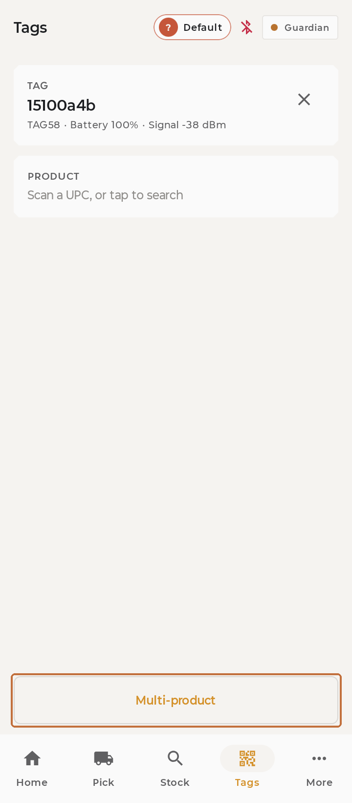
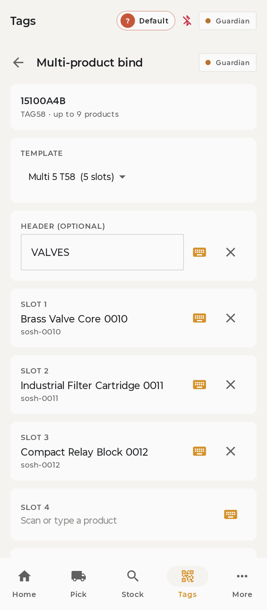
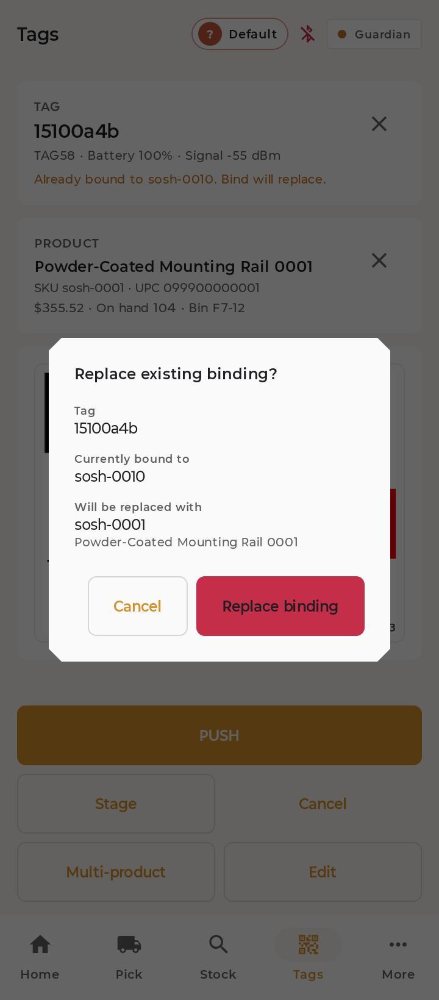

# Multi-product tags

**You'll learn:** how to load one large tag with several products — scan, scan, scan, save.

**Before you start:**

- Your handheld is unlocked, and you can see the **Tags** tab.
- You're at a **large** tag. Small tags hold one product only, and the button below won't appear for them.

!!! video "Watch: Multi-product tags (~4 min)"
    Video coming soon — the written steps below cover everything.

Some big tags show a whole line-up at once — paint colours, screw sizes. Here's how to fill one.

## Fill the grid

1. On the **Tags** tab, scan the tag's own barcode as usual. Because it's a large tag, a **Multi-product** button appears — tap it.

    

2. Pick a layout from the template list. The layout decides how many product slots you get — if the list is empty, your store hasn't set one up yet: ask your manager.

3. Want a heading across the top ("Interior Paints")? Type it in **HEADER (OPTIONAL)**.

4. Now just scan the products, one after another. Each scan drops into the next empty slot, top to bottom. Prefer typing? Tap any slot and search by name or number.

    

5. Tap **Save** — it wakes up once two or more slots are filled. The tag on the shelf updates in moments. Slots you left empty show as blank cells, and that's usually [exactly right](../reference/faq.md).

## Change it later

Scan the tag again and tap **Multi-product** — everything comes back pre-filled. Fix the one slot, save, done.

One thing to know: if you scan a tag that's already multi-product and then scan a *single* product against it the normal way, the app asks whether to turn it back into a one-product tag. That's a real question, not a hiccup — answer it.

## Check your work

- The shelf tag refreshes to show your products, in the order you scanned them.
- Scan the tag again — the editor pre-fills with the line-up you just saved.

## If something looks wrong

**No Multi-product button** — the tag's too small for it, or the feature is switched off for your store. Ask your manager.

**The template list is empty** — no multi-product layouts exist yet. That's a setup job on the manager's side — ask them.

**Save is greyed out** — you need at least two slots filled.

**A cell is blank on the shelf** — a trailing empty slot prints blank on purpose. If a *filled* slot is blank, the product may be brand new — it fills in on its own once it syncs. Still blank later? Tell your manager.

**Next:** More staff lessons are coming (picking orders, achievements). Meanwhile: [Will-call pickup signs](f6-will-call-pickup-signs.md).
