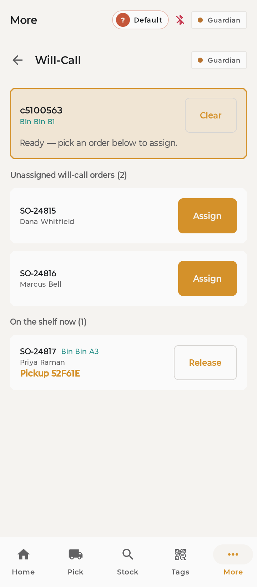
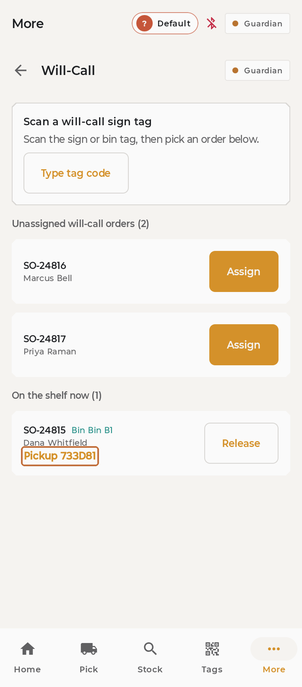
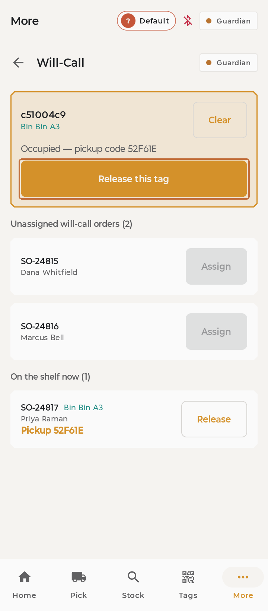

# Will-call pickup signs

**You'll learn:** how to put a customer's order on a pickup sign, and how to clear it when they collect.

**Before you start:**

- Your handheld is unlocked, and **Will-Call** shows in the **More** menu. If it's missing, this feature is turned off for your store — ask your manager.
- You know where your store's pickup bins are — the shelf spots with the big sign tags.

!!! video "Watch: Will-call pickup signs (~3 min)"
    Video coming soon — the written steps below cover everything.

An order is packed and waiting. Put it on a sign so the customer — and everyone at the counter — can find it at a glance.

## Put an order on a sign

1. Tap **More**, then **Will-Call**.

2. Scan the sign tag on the bin you're using. The app recognises it as a pickup sign and shows whether it's free.

    

3. Pick the customer's order from the list and confirm. The sign on the shelf flips to the customer's name and a short pickup code — the same code the app shows you.

    

That's it — no layout to choose, no settings. Scan, pick, done.

## Clear it at pickup

4. When the customer collects, scan the sign and tap **Release**. The sign goes back to its "available" look, ready for the next order.

    

No spare bin? You can put an order on almost any tag the same way — scan it in Will-Call and assign. When you release it, that tag simply goes back to showing the product it had before.

## Check your work

- The sign on the shelf shows the customer's name and pickup code within moments.
- After **Release**, the sign returns to its available look (or its old product, if you borrowed a product tag).

## If something looks wrong

**The tag says it's already taken** — that order hasn't been released yet. Release it first, then assign yours.

**The customer's order isn't in the list** — it may not have reached the system yet, or it's outside what your store pulls in. Ask your manager.

**The sign didn't change** — give it a moment; big signs take a few seconds to redraw. Still stuck after a minute? Tell your manager.

**Next:** More staff lessons are coming (picking orders, achievements). Until then, review [Update a shelf tag](f3-update-a-shelf-tag.md) or browse the [FAQ](../reference/faq.md).
